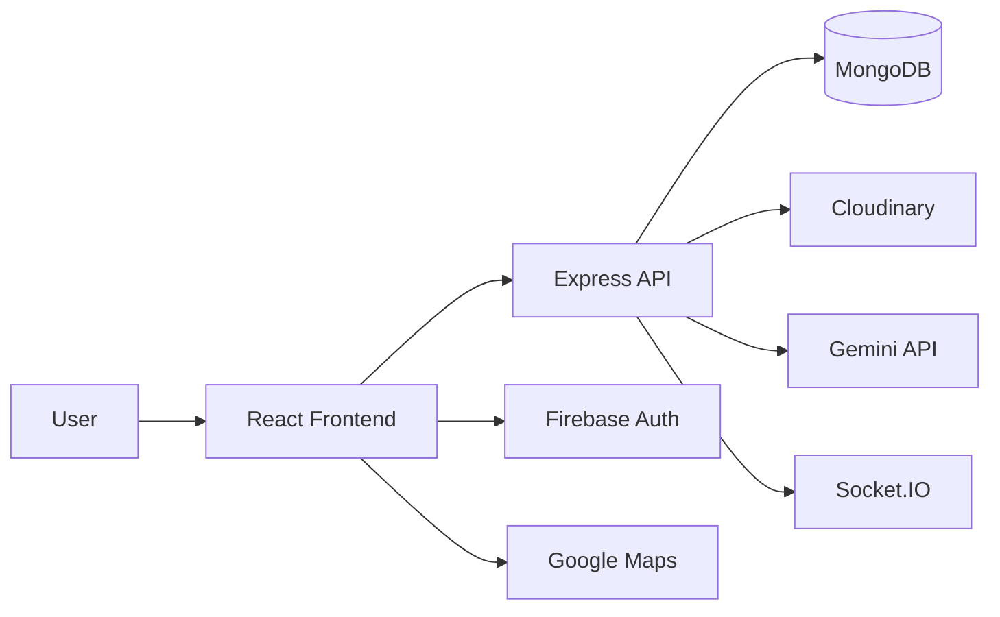

# URent

[](LICENSE)
[](https://nodejs.org)
[](https://www.typescriptlang.org)
[](https://react.dev)
[](https://expressjs.com)

A full-stack rental marketplace built with React, TypeScript, Node.js, Express, MongoDB, Socket.IO, Firebase, and AI-powered pricing assistance.

## 🚀 Live Demo

- Website: https://urent.vercel.app
- API Docs: http://localhost:5003/api-docs (local)

## ✨ Why this project stands out

- End-to-end marketplace experience with authentication, listings, booking, messaging, reviews, and admin workflows
- AI-assisted product valuation using Google Gemini
- Real-time chat and notifications powered by Socket.IO
- Modern frontend architecture with Vite + React + TypeScript
- Production-oriented documentation and deployment notes for recruiter and team use

## 📸 Suggested Screenshots

Recommended order for a polished demo gallery:

1. Landing page / marketplace homepage
2. Product detail and booking flow
3. Search and filtering experience
4. User dashboard and inventory management
5. Real-time chat / messaging
6. AI price estimation experience
7. Authentication and onboarding
8. Mobile-responsive view

## ⭐ Key Features

- Secure authentication with Firebase and JWT-backed sessions
- Product discovery with geolocation and map-based browsing
- Real-time messaging between renters and owners
- AI-assisted price estimation for listed items
- Cloudinary-powered media upload and management
- Admin tools for content and user oversight

## 🛠 Technology Stack

| Layer                | Technologies                                        |
| -------------------- | --------------------------------------------------- |
| Frontend             | React, Vite, TypeScript, Tailwind CSS, React Router |
| Backend              | Node.js, Express, TypeScript, Mongoose, Socket.IO   |
| Data & Media         | MongoDB, Cloudinary                                 |
| Auth & Notifications | Firebase, JWT, Nodemailer                           |
| AI                   | Google Gemini API                                   |
| Deployment           | Vercel, Node.js server runtime                      |

## 🧭 System Architecture



## 📁 Folder Structure

```text
urent-workspace/
├── urent-client/        # React + Vite frontend
├── urent-server/        # Express + TypeScript backend
├── docs/                # Architecture, deployment, API, and roadmap docs
├── scripts/             # Utility and automation scripts
└── package.json         # Monorepo scripts and metadata
```

## ⚙️ Installation

```bash
git clone https://github.com/your-username/URent.git
cd URent
npm install
```

## 🔐 Environment Variables

Copy the example files and update them:

```bash
cp urent-client/.env.example urent-client/.env
cp urent-server/.env.example urent-server/.env
```

Required variables include:

- Client: `VITE_API_URL`, `VITE_FIREBASE_*`
- Server: `PORT`, `MONGO_URI`, `JWT_SECRET`, `CLOUDINARY_*`, `FIREBASE_*`

## ▶️ Running Locally

```bash
npm run dev
```

- Frontend: http://localhost:5173
- Backend: http://localhost:5003
- Swagger: http://localhost:5003/api-docs

## 🚢 Deployment

The project is designed for Vercel-friendly frontend hosting and a Node.js-compatible backend runtime. For production deployment guidance, see [docs/DEPLOYMENT.md](docs/DEPLOYMENT.md).

## 📚 API Documentation

- Local Swagger UI: http://localhost:5003/api-docs
- Reference docs: [docs/API.md](docs/API.md)

## 🔮 Future Improvements

- CI/CD pipeline and automated releases
- Better test coverage and end-to-end validation
- Analytics and admin dashboards
- Enhanced moderation and trust scoring
- Mobile-first polish and performance tuning

## 👥 Contributors

- Team URent
- Open to contributions from interns, junior developers, and collaborators

## 📄 License

This project is licensed under the MIT License. See [LICENSE](LICENSE) for details.

---

<details>
<summary>Developer Notes</summary>

- Architecture overview: [docs/ARCHITECTURE.md](docs/ARCHITECTURE.md)
- Deployment guide: [docs/DEPLOYMENT.md](docs/DEPLOYMENT.md)
- Contribution rules: [CONTRIBUTING.md](CONTRIBUTING.md)
- Security policy: [SECURITY.md](SECURITY.md)
</details>
