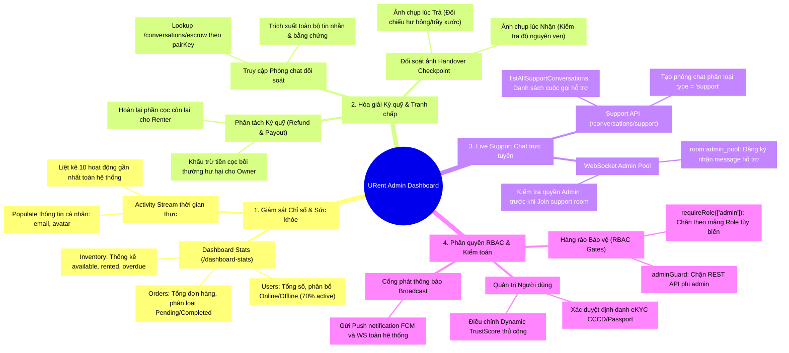
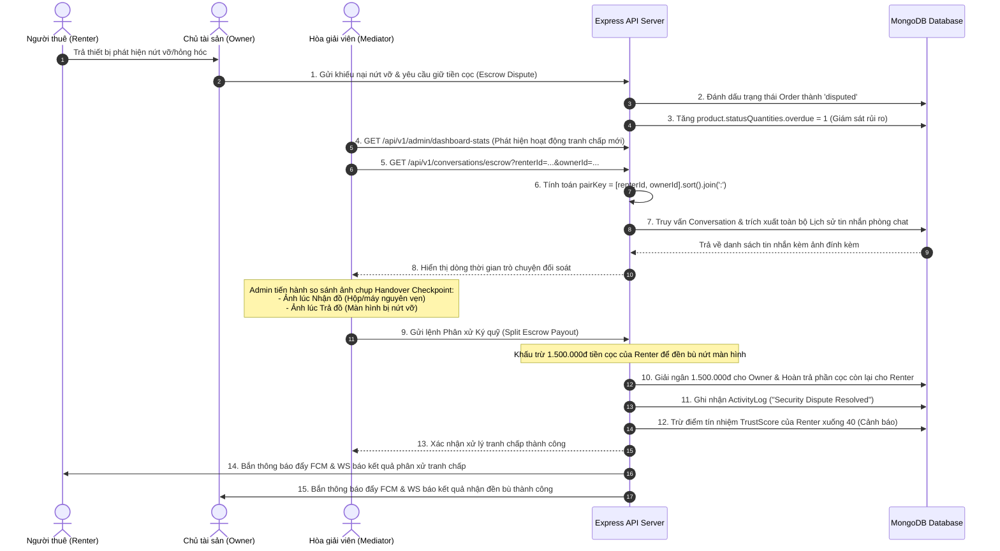
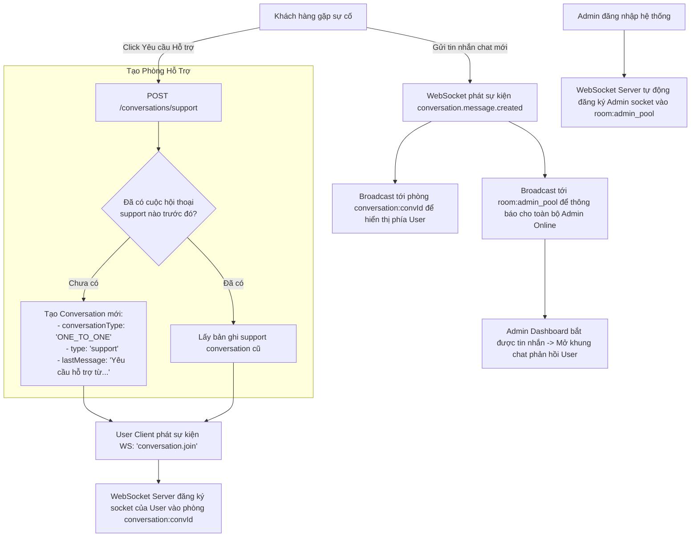

# 🛡️ Sơ Đồ Toàn Diện & Kiến Trúc - Phân Hệ Admin & Mediator (URent Ecosystem)

Tài liệu này trình bày sơ đồ tư duy (Mindmap), các biểu đồ luồng nghiệp vụ quản trị và phân giải tranh chấp (Sequence & Flowcharts) cùng thiết kế kiến trúc chi tiết của phân hệ **Admin Dashboard (Bảng điều khiển Quản trị)** và **Escrow Dispute Mediator Center (Phòng Hòa giải Tranh chấp Ký ký)** trong hệ sinh thái URent.

Hệ thống quản trị của URent áp dụng hàng rào phân quyền nghiêm ngặt (**RBAC Gates**) và hỗ trợ các tính năng quản trị thông minh: Giám sát luồng tiền ký quỹ, hòa giải tranh chấp bằng bằng chứng hình ảnh hiện trạng bàn giao (Handover Checkpoints) và kênh hỗ trợ trực tuyến Live Chat thời gian thực.

---

## 🧠 1. Sơ Đồ Tư Duy Tổng Quan Phân Hệ Admin (Mermaid Mindmap)

Dưới đây là sơ đồ tư duy phân tách các cột trụ quản trị: **Giám sát Chỉ số hệ thống**, **Phân xử Tranh chấp Tài chính (Dispute Room)**, **Hỗ trợ Khách hàng Live Chat**, và **Hệ thống Kiểm toán An ninh (Audit Logs)**.



---

## 🛡️ 2. Luồng Phân Xử Tranh Chấp Ký Quỹ (Escrow Dispute Resolution Sequence)

Khi có tranh chấp xảy ra giữa Người thuê (Renter) và Chủ đồ (Owner) về tình trạng tài sản hao hụt/hư hỏng, Admin sẽ đóng vai trò là Hòa giải viên (Mediator) truy cập vào **Dispute Room** để phân xử dựa trên bằng chứng hình ảnh không thể chối cãi tại các **Handover Checkpoints**:



---

## 💬 3. Kiến Trúc Live Support Chat thời gian thực (Customer Live Support Pipeline)

Hệ thống cho phép bất kỳ khách hàng nào khởi tạo một phiên **Live Support** kết nối trực tiếp với các Admin đang online qua kênh WebSocket:



---

## 🔒 4. Hàng Rào Bảo Vệ & Phân Quyền Admin (RBAC Gates)

Hệ thống áp dụng cơ chế phân quyền kép ở cả tầng REST API Middleware và WebSocket Gateway để chặn đứng mọi truy cập trái phép vào kho dữ liệu quản trị:

### 4.1 Hàng rào Bảo vệ REST API (`adminGuard`)
Middleware `adminGuard` chặn đứng toàn bộ các request không có quyền `admin` ngay tại tầng Route:
```typescript
import { Request, Response, NextFunction } from "express";
import { AppError } from "../utils/app-error";

export const adminGuard = (req: Request, res: Response, next: NextFunction) => {
  if (req.user?.role !== "admin") {
    return next(new AppError(403, "FORBIDDEN", "Quyền truy cập bị từ chối. Chỉ dành cho Admin."));
  }
  next();
};
```

### 4.2 Hàng rào Phân quyền Mảng tùy biến (`requireRole`)
Đối với các route quản trị linh hoạt hơn (hỗ trợ cho cả Moderator hoặc Mediator), route sử dụng `requireRole`:
```typescript
export const requireRole = (roles: string[]) => {
  return (req: any, res: any, next: any) => {
    if (!req.user) {
      return res.status(401).json({ success: false, error: { code: "UNAUTHORIZED" } });
    }
    if (!roles.includes(req.user.role)) {
      return res.status(403).json({ success: false, error: { code: "FORBIDDEN", message: `Yêu cầu quyền: ${roles.join(', ')}` } });
    }
    return next();
  };
};
```

### 4.3 Chốt chặn bảo mật WebSocket (Zero-Trust WS Verification)
Khi người dùng phát lệnh gia nhập phòng chat đối soát tranh chấp (`conversation.join`), WebSocket Gateway tiến hành kiểm tra chéo:
```typescript
const state = await getConversationAccessState(conversationId, userId);
let allowed = state.isMember;

// Nếu người dùng không phải thành viên phòng chat, nhưng là Admin và đây là phòng chat support / phòng tranh chấp
if (!allowed && userRole === "admin") {
  const conversation = await ConversationModel.findById(conversationId).select("type").lean();
  if (conversation?.type === "support") {
    allowed = true; // Cho phép Admin join vào phòng hỗ trợ
  }
}

if (!state.exists || !allowed) {
  ws.send(JSON.stringify({ type: "ack", id: data.id, success: false, error: { code: "FORBIDDEN" } }));
  return;
}
```

---

## 📊 5. Thuật Toán Thống Kê Tổng Hợp Chỉ Số Hệ Thống

Endpoint `/dashboard-stats` thực hiện truy vấn song song tối ưu hiệu năng và tính toán phân bổ dữ liệu:
1.  **Online/Offline Users**: Phân tích số lượng active user toàn sàn để ước lượng dòng người dùng trực tuyến.
2.  **Order Success Rate**:
    $$\text{Tỷ lệ Đơn thành công} = \frac{\text{delivered} + \text{confirmed} + \text{shipped}}{\text{Tổng số Đơn hàng}} \times 100\%$$
3.  **Inventory Quantities (Tổng lượng thiết bị)**: Quét toàn bộ danh mục sản phẩm và cộng dồn số lượng trạng thái trong mảng `statusQuantities` để kết xuất biểu đồ tròn biểu diễn năng lực cung cấp tài sản của URent:
    $$\text{Tổng kho tài sản} = \sum (\text{available} + \text{rented} + \text{overdue})$$

> [!TIP]
> **Audit Logging**: Mọi hành vi phân xử tranh chấp của Admin đều được ghi lại bất biến tại `ActivityLog` kèm theo mã `eventKey` đối soát, bảo đảm tính minh bạch tài chính tuyệt đối của sàn giao dịch cho thuê URent.
