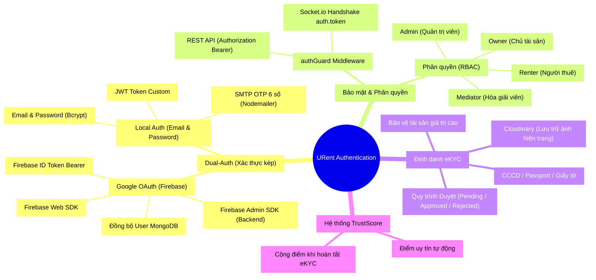
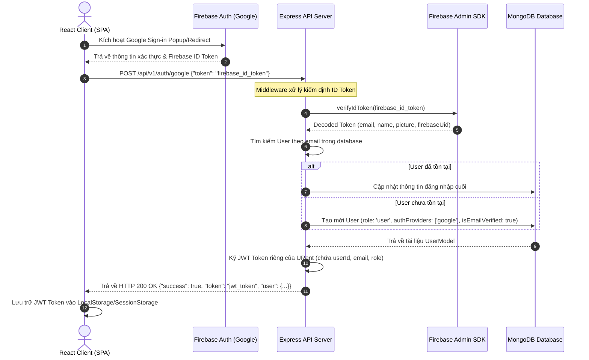
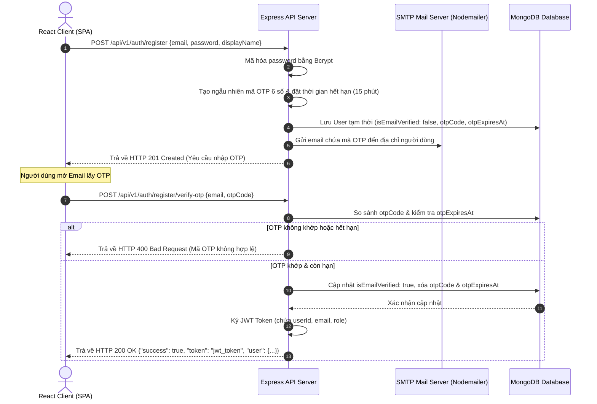

# 🔑 Sơ Đồ Tư Duy - Feature Authentication (URent Ecosystem)

Tài liệu này cung cấp một bản đồ tư duy (Mindmap) toàn diện và các mô hình kỹ thuật chi tiết về **Hệ thống Xác thực (Authentication) & Phân quyền (Authorization)** của URent, bao gồm cả hai cơ chế đăng nhập (Dual-Auth), Middleware kiểm soát truy cập (`authGuard`), WebSocket Handshake, quy trình eKYC bảo mật và hệ thống chấm điểm uy tín `TrustScore`.

---

## 🧠 1. Sơ Đồ Tư Duy Tổng Quan (Mermaid Mindmap)

Dưới đây là sơ đồ tư duy trực quan hóa toàn bộ hệ thống Authentication của URent, phân tách thành 4 nhánh chiến lược: **Cơ chế Xác thực Kép**, **Bảo mật & Middleware**, **Định danh eKYC**, và **Hệ thống Tín nhiệm TrustScore**.



---

## 🔄 2. Luồng Hoạt Động Chi Tiết (Detailed Authentication Flows)

Hệ thống **Dual-Auth** của URent được tối ưu hóa để vừa mang lại trải nghiệm mượt mà của Google Single Sign-On (SSO), vừa đảm bảo an toàn tuyệt đối qua quy trình xác minh Email OTP cục bộ.

### 2.1 Luồng Xác Thực Google (Firebase OAuth)
Phương thức này sử dụng Firebase Client SDK để xác thực ở phía Client, sau đó chuyển giao Firebase ID Token cho Backend xác minh qua Firebase Admin SDK để sinh Identity đồng bộ trong MongoDB.



### 2.2 Luồng Đăng Ký & Đăng Nhập Local (Email/Password + SMTP OTP)
Nhằm giảm thiểu việc spam tài khoản ảo, mọi quy trình đăng ký tài khoản local đều được bảo vệ bởi mã OTP 6 số gửi trực tiếp qua Gmail/SMTP Server của Nodemailer.



---

## 🛡️ 3. Kiến Trúc Bảo Mật & Phân Quyền (Middleware & RBAC)

Hệ thống bảo vệ tài nguyên của URent được xây dựng chặt chẽ trên mô hình **Zero-Trust**: Mọi API được bảo vệ và kết nối Socket thời gian thực đều phải đi qua chốt chặn bảo mật (`authGuard`).

### 3.1 Quy Trình Kiểm Duyệt của `authGuard` Middleware

```mermaid
flowchart TD
    A[Bắt đầu Request] --> B{Có Authorization Header trong HTTP?}
    B -- Không --> C[Trả về HTTP 401 Unauthorized]
    B -- Có --> D{Token có đúng định dạng 'Bearer <Token>'?}
    D -- Không --> C
    D -- Có --> E[Giải mã Token & Verify chữ ký JWT]
    E -- Hết hạn hoặc sai chữ ký --> F{Token có phải Firebase ID Token?}
    F -- Đúng --> G[Verify token qua Firebase Admin SDK]
    F -- Không --> C
    G -- Lỗi/Hết hạn --> C
    G -- Hợp lệ --> H[Trích xuất User Identity từ payload]
    E -- Hợp lệ --> H
    H --> I[Truy vấn kiểm tra trạng thái User trong MongoDB]
    I -- Không tìm thấy hoặc tài khoản bị khóa --> C
    I -- Tài khoản Active --> J[Gắn req.user = { id, email, role }]
    J --> K{Endpoint có yêu cầu Role đặc biệt? e.g., Admin}
    K -- Không --> L[Next() -> Cho phép truy cập Controller]
    K -- Có --> M{req.user.role == Yêu cầu?}
    M -- Sai Role --> N[Trả về HTTP 403 Forbidden]
    M -- Đúng Role --> L
```

### 3.2 WebSocket Authentication
Để đảm bảo các kênh trò chuyện thời gian thực chỉ có sự tham gia của các bên được cấp quyền, Socket.IO Server bắt buộc thực hiện kiểm tra Token ngay tại bước **Handshake**:

```javascript
import { io } from "socket.io-client";

// React Client khởi tạo kết nối kèm Token
const socket = io("http://localhost:5003", {
  auth: {
    token: "Bearer <Local_JWT_hoac_Firebase_ID_Token>"
  }
});
```

*   **Tại Backend:** Middleware Socket.IO trích xuất `auth.token`, giải mã và xác thực. Nếu token không hợp lệ, socket sẽ bị từ chối kết nối (`disconnect`) ngay lập tức với lỗi `UNAUTHORIZED`.
*   **Tham gia Phòng Chat (Room):** Khi Client phát tín hiệu `conversation.join { conversationId }`, Socket Server kiểm tra trong MongoDB xem `req.user.id` có thuộc danh sách `participants` của phòng chat đó hay không. Nếu không, lập tức từ chối cho vào phòng nhằm ngăn chặn rò rỉ dữ liệu.

---

## 🪪 4. Định Danh eKYC & Tích Hợp TrustScore

Để xây dựng một nền tảng thuê tài sản an toàn, không rủi ro, URent giới thiệu quy trình định danh điện tử eKYC tích hợp cùng hệ thống chấm điểm tín nhiệm tự động.

### 4.1 Quy trình eKYC (Định Danh Người Dùng)
Để thuê các sản phẩm giá trị lớn (như máy ảnh chuyên nghiệp, laptop gaming), người dùng bắt buộc phải xác thực thông tin định danh:

```text
┌──────────────┐      Tải lên ảnh CCCD/Passport      ┌──────────────────────┐
│ React Client │ ──────────────────────────────────> │ Cloudinary Storage   │
└──────────────┘                                     └──────────────────────┘
        │                                                       │
        │ Gửi dữ liệu yêu cầu xác thực                          │ Trả về Secure URL
        ▼                                                       ▼
┌──────────────┐      Tạo bản ghi eKYC: PENDING      ┌──────────────────────┐
│ Express API  │ ──────────────────────────────────> │ MongoDB Database     │
└──────────────┘                                     └──────────────────────┘
        │
        │ Hiển thị trên Admin Dashboard
        ▼
┌──────────────┐      Duyệt/Từ chối thủ công         ┌──────────────────────┐
│ Admin/Mediator│ ──────────────────────────────────> │ Cập nhật Trạng thái  │
└──────────────┘                                     │ (APPROVED / REJECTED)│
                                                     └──────────────────────┘
```

*   **Quy tắc giới hạn:** Hệ thống kiểm tra điều kiện eKYC tại middleware trước khi renter tạo đơn thuê (`POST /api/v1/orders`). Các sản phẩm được Owner gắn nhãn "High Value" sẽ chặn ngay các tài khoản chưa được phê duyệt eKYC (`APPROVED`).

### 4.2 Hệ Thống Điểm Tín Nhiệm (Dynamic TrustScore)
Mỗi tài khoản lưu trữ trường `trustScore` trong MongoDB biểu thị mức độ uy tín của họ trong hệ thống:
*   `100` **(Tuyệt vời):** Đã xác minh eKYC, lịch sử hoàn trả đúng hẹn, không có khiếu nại.
*   `60` **(Khá):** Tài khoản bình thường chưa eKYC, hoạt động ổn định.
*   `40` **(Trung bình):** Từng trễ hạn trả đồ nhẹ, hoặc có khiếu nại nhẹ từ Owner.
*   `10` **(Cảnh báo rủi ro):** Có tranh chấp nghiêm trọng, đang chờ xử lý hoặc trễ hạn lâu ngày. Bị giới hạn các tính năng thuê đồ cao cấp.

---

## 🗃️ 5. Chi Tiết MongoDB Schema (Cơ Sở Dữ Liệu Authentication)

Dưới đây là trích đoạn định nghĩa các trường lưu trữ trạng thái xác thực trong Collection `users`:

```json
{
  "_id": "ObjectId",
  "email": { "type": "String", "unique": true, "required": true },
  "password": { "type": "String", "required": false }, // Chỉ dùng cho Local Auth
  "authProviders": ["local", "google"], // Mảng các phương thức đã liên kết
  "isEmailVerified": { "type": "Boolean", "default": false },
  "otpCode": { "type": "String" }, // Dùng cho Register OTP
  "otpExpiresAt": { "type": "Date" },
  "loginOtpCode": { "type": "String" }, // Dùng cho 2FA OTP
  "loginOtpExpiresAt": { "type": "Date" },
  "resetToken": { "type": "String" }, // Phục hồi mật khẩu
  "resetTokenExpiresAt": { "type": "Date" },
  "role": { "type": "String", "enum": ["user", "admin"], "default": "user" },
  "trustScore": { "type": "Number", "enum": [100, 60, 40, 10], "default": 100 },
  "ekycStatus": { "type": "String", "enum": ["NONE", "PENDING", "APPROVED", "REJECTED"], "default": "NONE" },
  "ekycDocuments": {
    "documentType": { "type": "String", "enum": ["CCCD", "Passport"] },
    "frontImageUrl": { "type": "String" },
    "backImageUrl": { "type": "String" },
    "verifiedAt": { "type": "Date" }
  }
}
```

> [!TIP]
> **Khuyến nghị bảo mật:** Trong môi trường Production, JWT Token của URent nên sử dụng thời gian hết hạn ngắn (ví dụ: `15m` đến `1h`) kết hợp cơ chế Refresh Token lưu giữ trong HttpOnly Cookie để chống các cuộc tấn công XSS hiệu quả.
