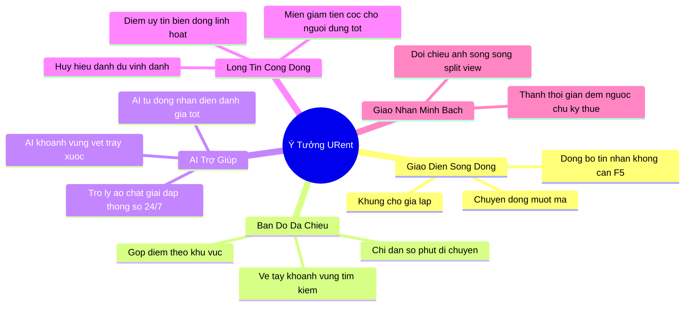

# 🚀 URent - Định Hướng & Ý Tưởng Nâng Cấp Trang Web (Web Upgrade Ideas)

> [!NOTE]  
> Tài liệu tóm tắt các ý tưởng đột phá nhằm nâng cấp tính năng và trải nghiệm người dùng (UX/UI) của trang web **URent** trong tương lai, tập trung vào sự tiện lợi, tính tương tác cao và xây dựng lòng tin cộng đồng.

---

## 🧭 1. Tầm Nhìn Trải Nghiệm
Dịch chuyển trang web từ công cụ giao dịch thông thường thành **không gian chia sẻ tài sản sống động và tin cậy**: *"Chạm là phản hồi, nhìn là tin tưởng, giao dịch trong vài giây."*

---

## 💡 2. Năm Ý Tưởng Đột Phá Nâng Cấp Trang Web

### 1. Trải nghiệm Sống động & Tải ngầm (Fluid UX)
*   **Chuyển động có hồn:** Các hiệu ứng chuyển trang, đóng mở hộp thoại mượt mà tự nhiên, giảm cảm giác chờ đợi gián đoạn.
*   **Khung chờ giả lập:** Hiển thị khung xương giao diện (Skeleton) động thay vì icon xoay tròn truyền thống khi tải dữ liệu.
*   **Cập nhật ngầm:** Tự động đồng bộ tin nhắn mới và trạng thái đơn hàng tức thì mà không cần tải lại trang (F5).

### 2. Bản đồ Tương tác Vẽ tay & Gộp điểm (Smart Map)
*   **Gộp cụm điểm thông minh:** Tự động nhóm các sản phẩm gần nhau thành bong bóng số lượng theo khu vực để bản đồ luôn thoáng mắt.
*   **Vẽ tay khoanh vùng:** Người dùng tự vẽ một vòng tròn bất kỳ trên bản đồ để lọc nhanh các đồ dùng trong vùng đó.
*   **Chỉ đường thực tế:** Hiển thị trực quan số phút di chuyển bằng xe máy/ô tô từ người thuê đến chủ đồ ngay trên trang sản phẩm.

### 3. Đăng tin & Hỗ trợ rảnh tay với AI (AI Assistant)
*   **AI tự ghi nhận hiện trạng:** Tự động phát hiện và vẽ khung đỏ khoanh vùng các vết trầy xước từ ảnh chụp đăng tin để làm biên bản lúc bàn giao.
*   **Trợ lý ảo thông tin sản phẩm:** AI tự đọc mô tả để chat trả lời nhanh mọi câu hỏi chi tiết về đồ dùng (phụ kiện, lưu ý...) 24/7 thay thế chủ đồ.
*   **Bộ lọc cảm xúc bình luận:** AI tự động phân tích hàng trăm đánh giá để gắn nhãn nhanh như `[Đồ dùng siêu mới]`, `[Chủ nhà thân thiện]`.

### 4. Hệ sinh thái Lòng tin & Ưu đãi cọc (Trust System)
*   **Điểm uy tín động:** Thang điểm biến động linh hoạt (cộng điểm khi trả đúng hạn/nhận 5 sao, trừ điểm khi hủy đơn sát giờ/trả trễ).
*   **Chính sách miễn giảm cọc:** Người dùng có điểm uy tín cao được tự động giảm giá trị cọc hoặc miễn đặt cọc hoàn toàn trực tiếp trên giao diện.
*   **Huy hiệu danh dự:** Vinh danh các thành viên văn minh bằng các danh hiệu như *"Đại sứ đúng giờ"*, *"Chủ nhà siêu tốc"*.

### 5. Giao nhận "Không Tranh Chấp" bằng Hình ảnh (Zero-Dispute)
*   **Đối chiếu ảnh song song (Split-View):** Màn hình chia đôi so sánh trực quan ảnh chụp lúc nhận đồ và ảnh chụp lúc trả đồ để giải quyết nhanh mọi khiếu nại.
*   **Thanh tiến trình đếm ngược:** Dòng thời gian động đếm ngược giờ giao nhận và nhắc nhở hai bên sắp xếp cuộc hẹn chính xác.

---

## 📅 3. Lộ Trình Triển Khai Rút Gọn
*   **Phase 1 (Giao diện & Tương tác tức thì):** Nâng cấp chuyển động mượt mà, khung chờ giả lập và đồng bộ tin nhắn ngầm.
*   **Phase 2 (Bản đồ & Đối soát hình ảnh):** Gộp nhóm trên bản đồ, tính toán khoảng cách thực tế và màn hình so sánh ảnh song song (Split-View).
*   **Phase 3 (AI hỗ trợ & Điểm uy tín):** Tích hợp AI trợ lý sản phẩm 24/7, AI phát hiện vết xước, thang điểm uy tín và chính sách ưu đãi cọc động.
