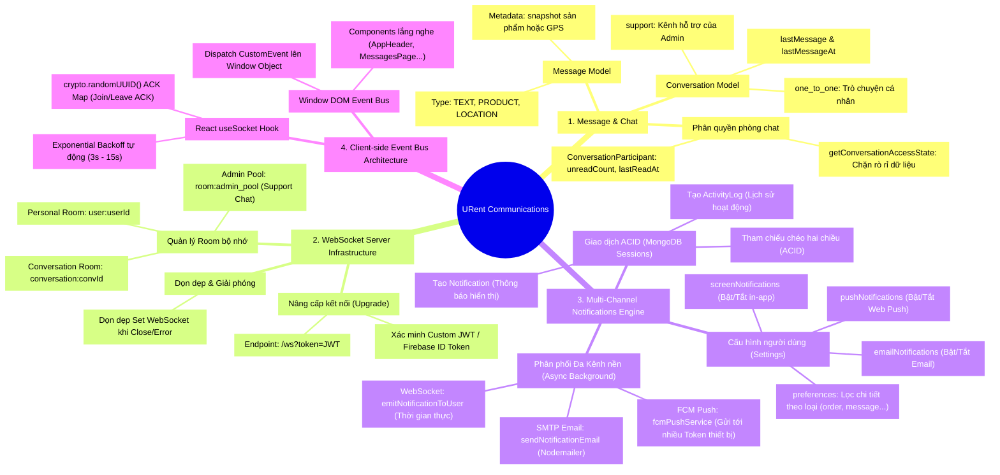
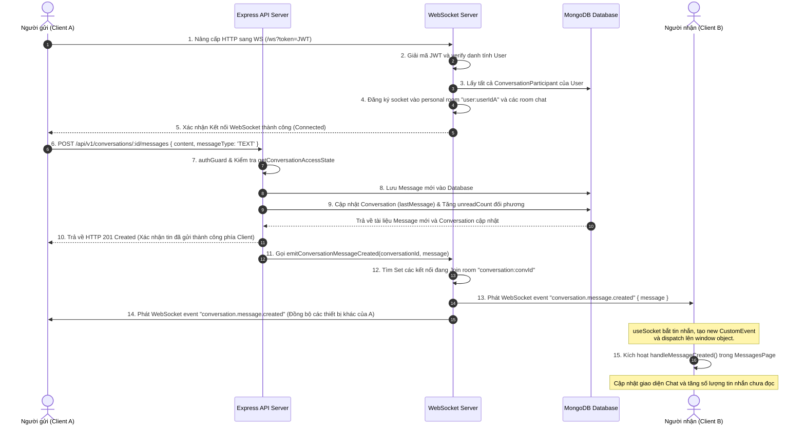

# 💬 Sơ Đồ Toàn Diện & Kiến Trúc - Phân Hệ Message & Notification (URent Ecosystem)

Tài liệu này trình bày sơ đồ tư duy (Mindmap), các biểu đồ luồng nghiệp vụ thời gian thực (Sequence & Flowcharts) cùng kiến trúc hệ thống chi tiết của hai phân hệ cốt lõi: **Message (Trò chuyện thời gian thực)** và **Notification (Thông báo đa kênh - WS, FCM, Email)** trong hệ sinh thái URent.

Hệ thống giao tiếp của URent được tối ưu hóa tối đa về trải nghiệm người dùng bằng cách sử dụng **Native WebSocket Server (Thư viện `ws`)** có khả năng tự động kết nối lại và kiến trúc **Event Bus (CustomEvent)** độc đáo ở phía Client, kết hợp cùng bộ điều phối thông báo **Ký quỹ giao dịch đa kênh (WebSocket, Firebase Cloud Messaging Push, SMTP Nodemailer Email)** hoạt động song song dưới dạng tác vụ nền (asynchronous background worker).

---

## 🧠 1. Sơ Đồ Tư Duy Tổng Quan Phân Hệ Giao Tiếp (Mermaid Mindmap)

Dưới đây là sơ đồ tư duy phân tách 4 trụ cột chính: **Cấu trúc Dữ liệu trò chuyện**, **Hạ tầng WebSocket Server**, **Động cơ điều phối thông báo đa kênh**, và **Kiến trúc luồng sự kiện phía Client**.



---

## 🔄 2. Luồng Trò Chuyện Thời Gian Thực Chi Tiết (Real-time Messaging Pipeline)

Hệ thống tin nhắn của URent hoạt động theo mô hình **Hybrid REST & WebSocket**: Khách hàng gửi tin nhắn qua HTTP POST để tận dụng các Middleware bảo mật, xác thực Zod, và ghi nhận MongoDB đồng bộ, sau đó Server phát tín hiệu thời gian thực (WebSockets) để cập nhật giao diện ngay lập tức cho các bên tham gia phòng chat.



---

## 🔔 3. Luồng Phân Phối Thông Báo Đa Kênh (Multi-Channel Notification Dispatch Pipeline)

Bất kỳ hành động nghiệp vụ quan trọng nào (tạo đơn hàng mới, cập nhật trạng thái đơn hàng, tranh chấp tài sản) đều kích hoạt bộ điều phối thông báo đa kênh. Quy trình này bảo đảm thông tin không bao giờ bị bỏ lỡ, ngay cả khi người dùng tắt trình duyệt.

```mermaid
flowchart TD
    Start[Nghiệp vụ phát sinh Event: e.g., Trạng thái đơn hàng Thay đổi] --> SessionStart[Khởi tạo MongoDB Transaction Session]
    
    subgraph ACID Transaction [Giao dịch Đảm bảo Dữ liệu]
        SessionStart --> CreateActivity[Tạo bản ghi ActivityLog mới]
        CreateActivity --> CreateNotif[Tạo bản ghi Notification liên kết]
        CreateNotif --> UpdateRef[Thiết lập tham chiếu chéo hai chiều activityLogId <-> notificationId]
        UpdateRef --> CommitSession[Commit Transaction & Kết thúc Session]
    end

    CommitSession --> BackgroundDispatch["Khởi tạo Asynchronous Background Worker
    (Không chặn luồng phản hồi API của hệ thống)"]
    
    BackgroundDispatch --> QuerySettings[Truy vấn Settings cấu hình thông báo của User]
    
    QuerySettings --> ScreenNotifCheck{settings.screenNotifications != false?}
    QuerySettings --> PushNotifCheck{settings.pushNotifications != false?}
    QuerySettings --> EmailNotifCheck{settings.emailNotifications != false?}

    %% Kênh In-App WS
    ScreenNotifCheck -->|Đồng ý| WS_PrefCheck{Kiểm tra cài đặt cụ thể\npreferences[type].inApp != false?}
    WS_PrefCheck -->|Đồng ý| WS_Emit[Phát sự kiện notification.created qua WebSocket tới personal room user:userId]
    WS_Emit --> WS_Client[Client nhận -> Dispatch CustomEvent -> Hiện Pop-up Toast in-app]

    %% Kênh Web Push FCM
    PushNotifCheck -->|Đồng ý| FCM_PrefCheck{Kiểm tra cài đặt cụ thể\npreferences[type].push != false?}
    FCM_PrefCheck -->|Đồng ý| FCM_GetTokens[Lấy tất cả token đã đăng ký từ FcmToken Collection]
    FCM_GetTokens --> FCM_Send[Gửi thông báo Multicast qua Firebase Admin SDK]
    FCM_Send --> FCM_Response{Có thiết bị lỗi/hết hạn?}
    FCM_Response -->|Có| FCM_Cleanup[Tự động xóa sạch các token stale khỏi database]
    FCM_Response -->|Không| FCM_End[Hoàn tất gửi Push]

    %% Kênh Email Nodemailer
    EmailNotifCheck -->|Đồng ý| Email_PrefCheck{Kiểm tra cài đặt cụ thể\npreferences[type].email != false?}
    Email_PrefCheck -->|Đồng ý| Email_Get[Lấy địa chỉ email của User từ UserModel]
    Email_Get --> Email_Send[Gửi email định dạng HTML chuẩn qua Nodemailer SMTP Server]
    Email_Send --> Email_End[Hoàn tất gửi thư]

    ScreenNotifCheck & PushNotifCheck & EmailNotifCheck -->|Từ chối| Ignore[Bỏ qua kênh này]
```

---

## 🗃️ 4. Chi Tiết Thiết Kế MongoDB Schema & Socket Rooms

### 4.1 Collection `conversations` (Bản ghi Cuộc trò chuyện)
```json
{
  "_id": "ObjectId",
  "conversationType": { "type": "String", "enum": ["ONE_TO_ONE"], "default": "ONE_TO_ONE" },
  "type": { "type": "String", "enum": ["one_to_one", "support"], "default": "one_to_one" }, // one_to_one hoặc support chat với admin
  "pairKey": { "type": "String", "unique": true, "sparse": true }, // 'userId1_userId2' đảm bảo không bị tạo trùng cuộc trò chuyện
  "lastMessage": { "type": "String" }, // Trích đoạn tin nhắn hiển thị ở danh sách chat
  "lastMessageAt": { "type": "Date", "default": "Date.now" },
  "createdAt": "Date",
  "updatedAt": "Date"
}
```

### 4.2 Collection `messages` (Dữ liệu Tin nhắn)
```json
{
  "_id": "ObjectId",
  "conversationId": { "type": "ObjectId", "ref": "Conversation", "index": true },
  "senderId": { "type": "ObjectId", "ref": "User", "index": true },
  "messageType": { "type": "String", "enum": ["TEXT", "PRODUCT", "LOCATION"] },
  "content": { "type": "String", "maxlength": 2000 },
  "metadata": {
    // Dùng Schema.Types.Mixed để lưu trữ linh hoạt theo loại tin nhắn:
    // 1. PRODUCT: { productId, snapshot: { name, pricePerDay, imageUrl, category } }
    // 2. LOCATION: { latitude, longitude, address }
  },
  "createdAt": "Date",
  "updatedAt": "Date"
}
```

### 4.3 Cấu trúc các Phòng Socket (Server-side Rooms Map)
WebSocket Server biểu diễn các phòng bằng cấu trúc **`Map<string, Set<WebSocket>>`** lưu trong bộ nhớ RAM của Node.js:
1.  **Personal User Room (`user:${userId}`)**: Mỗi người dùng kết nối sẽ tự động tham gia vào phòng cá nhân của mình. Phòng này dùng để phát các sự kiện chỉ định đích danh (ví dụ: `notification.created`).
2.  **Conversation Room (`conversation:${conversationId}`)**: Phòng dành cho các thành viên của một cuộc trò chuyện cụ thể. Khi bất kỳ ai gửi tin nhắn mới, sự kiện `conversation.message.created` sẽ được broadcast tới toàn bộ Set socket trong phòng.
3.  **Admin Pool Room (`room:admin_pool`)**: Nơi tất cả Admin/Hòa giải viên có kết nối Socket hoạt động đăng ký tham gia. Phòng này dùng để nhận các yêu cầu trò chuyện hỗ trợ (`type: 'support'`) từ khách hàng.

---

## 🌐 5. Đặc Tả Giao Tiếp Phía Client (React WebSockets & DOM Event Bus)

Kiến trúc Client của URent được tối ưu hóa cực kỳ gọn nhẹ bằng cách tránh lạm dụng Redux hoặc truyền tải Prop-Drilling phức tạp. Thay vào đó, hệ thống sử dụng một **Event Bus** dựa trên cơ chế sự kiện DOM gốc của trình duyệt.

```text
                                  ┌─────────────────────────┐
                                  │   WebSocket Connection  │
                                  └─────────────────────────┘
                                               │
                                               │ event.data (JSON)
                                               ▼
                                  ┌─────────────────────────┐
                                  │   useSocket Context     │
                                  └─────────────────────────┘
                                               │
                                               │ new CustomEvent(type, {detail})
                                               ▼
                                  ┌─────────────────────────┐
                                  │  window.dispatchEvent   │
                                  └─────────────────────────┘
                                               │
                   ┌───────────────────────────┼───────────────────────────┐
                   │                           │                           │
                   ▼                           ▼                           ▼
      ┌─────────────────────────┐ ┌─────────────────────────┐ ┌─────────────────────────┐
      │ AppHeader (Bell Icon)   │ │ MessagesPage (Chat UI)  │ │ AdminLayout             │
      │ - Update unread badges  │ │ - Append message stream │ │ - Real-time alerts      │
      └─────────────────────────┘ └─────────────────────────┘ └─────────────────────────┘
```

### 5.1 Giải pháp Chống Mất Kết Nối (Exponential Backoff Reconnect)
Để đảm bảo kết nối Socket luôn thông suốt khi người dùng di chuyển hoặc mạng chập chờn, hook `useSocket` triển khai thuật toán tự động kết nối lại thông minh:
*   Mỗi khi socket phát sinh sự kiện `onclose` hoặc `onerror`, hệ thống sẽ kích hoạt bộ hẹn giờ với khoảng trễ khởi điểm `INITIAL_RECONNECT_DELAY = 3000ms`.
*   Nếu kết nối lại thất bại, khoảng trễ sẽ tự động nhân đôi ở các lượt tiếp theo để bảo vệ tài nguyên hệ thống, giới hạn tối đa `MAX_RECONNECT_DELAY = 15000ms`.
*   Khi kết nối lại thành công, khoảng trễ tự động reset về mức 3000ms ban đầu.

### 5.2 Cơ chế Yêu cầu và Xác nhận (ACK - Acknowledgment Map)
Đối với các hành động cần đảm bảo trạng thái thành công tuyệt đối từ phía Server (ví dụ: tham gia phòng chat `conversation.join`), Client sử dụng cơ chế ACK:
1.  Tạo ra một định danh UUID ngẫu nhiên duy nhất cho request: `const id = crypto.randomUUID()`.
2.  Đăng ký callback tương ứng vào bản đồ ACK: `ackMap.current.set(id, callback)`.
3.  Gửi payload JSON kèm ID này qua Socket.
4.  Khi Server xử lý xong, Server gửi lại sự kiện `type: "ack"` kèm đúng ID đó. Client bắt được sẽ thực thi callback đã lưu và xóa key khỏi `ackMap` để tránh rò rỉ bộ nhớ.
5.  **ACK Timeout**: Thiết lập `setTimeout` 10 giây. Quá 10 giây nếu Server không phản hồi, Client tự động hủy đăng ký và trả lỗi `ACK_TIMEOUT`.

> [!IMPORTANT]
> **Đảm bảo bảo mật**: WebSocket Server của URent áp dụng nguyên tắc **Zero-Trust**. Khi người dùng gửi yêu cầu tham gia phòng chat (`conversation.join`), Server không bao giờ tin cậy Client cung cấp danh sách thành viên. Thay vào đó, Server luôn thực hiện truy vấn độc lập trong database MongoDB thông qua hàm `getConversationAccessState(conversationId, userId)` để đối soát xem người dùng hiện tại có thực sự là một trong các `participants` hợp lệ của phòng chat đó hay không, ngăn chặn triệt để nguy cơ tấn công đánh cắp thông tin phòng chat từ xa.
