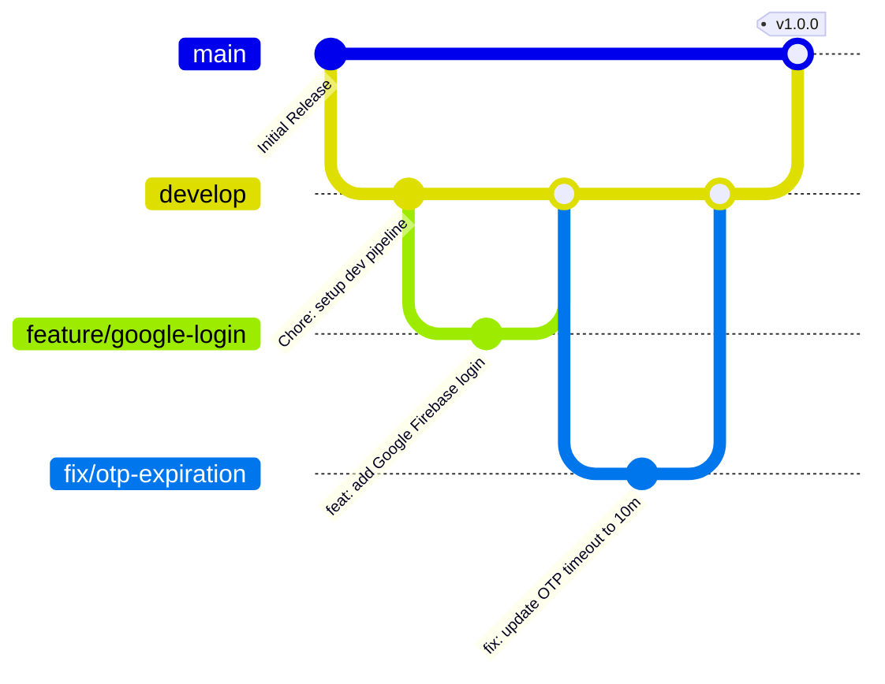

# 🚀 Developer Onboarding & Development Guidelines

Welcome to the **URent** ecosystem! This document is designed to get you up and running within 30 minutes, ensuring your development workflow integrates smoothly with the rest of the team.

---

## 1. 30-Minute Quickstart

### Prerequisites
- **Node.js**: `v20.x` or higher (configured via `.node-version` and `.nvmrc`)
- **Package Manager**: `npm` (monorepo workspaces enabled)
- **MongoDB**: A running local instance or MongoDB Atlas cluster connection string.
- **Firebase**: A Google Firebase Project with Authentication enabled (Google Sign-In & OTP support).

### Step-by-Step Setup
1. **Clone the Repository**:
   ```bash
   git clone <repository-url>
   cd mindx.x41.team4.URent
   ```
2. **Install Dependencies**:
   Install all package workspace dependencies in one command from the root directory:
   ```bash
   npm install
   ```
3. **Configure Environment Variables**:
   - In `urent-client/`: Copy `.env.example` to `.env` and fill in Firebase configurations.
   - In `urent-server/`: Copy `.env.example` to `.env` and configure MongoDB, JWT, SMTP, and Firebase Admin.
4. **Boot Up the Development Environment**:
   Run both Frontend and Backend concurrently with standard logs prefixing:
   ```bash
   npm run dev
   ```
   - **Frontend URL**: [http://localhost:5173/](http://localhost:5173/)
   - **Backend URL**: [http://localhost:5003/](http://localhost:5003/)
   - **Interactive API Docs (Swagger)**: [http://localhost:5003/api-docs](http://localhost:5003/api-docs)

---

## 2. Directory Structure Roadmap

URent uses an **npm workspaces monorepo** containing two main packages: `urent-client` (Frontend) and `urent-server` (Backend).

```text
mindx.x41.team4.URent/
├── urent-client/               # React & Vite Frontend Package
│   ├── src/
│   │   ├── features/           # Feature-based architectural split
│   │   │   ├── admin/          # Admin Backoffice Dashboard & Moderator controls
│   │   │   └── user/           # Core Customer domains (Auth, Inventory, Orders, Messages, etc.)
│   │   ├── lib/                # Third-party adapters (Axios instance, Firebase app check)
│   │   ├── shared/             # Reusable UI component catalog and utilities
│   │   ├── App.tsx             # Master React Router 7 setup
│   │   └── index.css           # Styling hub containing Tailwind v4 design tokens
│   ├── tailwind.config.ts      # Tailwind CSS configuration
│   └── vite.config.ts          # Vite asset pipeline bundler config
│
├── urent-server/               # Express 5 REST API & WebSocket Server
│   ├── src/
│   │   ├── config/             # DB connections, Firebase admin, and Cloudinary setups
│   │   ├── controllers/        # Incoming HTTP controllers
│   │   ├── middlewares/        # Express pipeline filters (authGuard, validateBody, errorMiddleware)
│   │   ├── models/             # Mongoose Schemas & Database entities
│   │   ├── realtime/           # Socket.IO WebSocket handlers and namespace channels
│   │   ├── routes/             # Core router mounts (versioned under /api/v1)
│   │   ├── services/           # Decoupled business logic domain layer
│   │   ├── validators/         # Zod schemas validating incoming request payloads
│   │   ├── utils/              # Internal utilities (Tokens, Otp, Cloudinary uploder helper)
│   │   └── server.ts           # Bootloader launching HTTP and Socket servers
│
└── scripts/                    # Shared operational and sync scripts
```

### Feature-Based Architecture (Frontend)
To maintain code clean-up as components grow, `urent-client` organizes code inside `src/features/` by business domain. Each feature contains:
- `components/`: UI components exclusive to this feature.
- `pages/`: Routable, high-level React components representing full views.
- `hooks/`: Specialized state machine hooks and side-effects handlers.
- `services/`: Axios HTTP calls dedicated to this feature.
- `types.ts`: Localized TypeScript interfaces.
- `constants.ts`: Feature constants and configurations.

---

## 3. Code Style & Naming Conventions

Consistency keeps our codebase highly readable and maintainable. We enforce the following:

| Artifact Type | Convention | Example |
| :--- | :--- | :--- |
| **Directories** | `kebab-case` | `auth-flow`, `user-profile` |
| **React Components** | `PascalCase` | `ProductCard.tsx`, `MessagesPage.tsx` |
| **Logic & Helper files** | `camelCase` | `apiClient.ts`, `useSocket.ts` |
| **Functions & Variables** | `camelCase` | `calculateTotalPrice()`, `isEmailVerified` |
| **Global Constants** | `UPPER_SNAKE_CASE` | `JWT_SECRET`, `API_REQUEST_TIMEOUT` |
| **Database Collections** | `singular PascalCase` | `User` Model $\rightarrow$ `users` Collection |

### TypeScript Coding Rules
1. **Never use `any`**: If a type is uncertain, use `unknown` and perform strict type-guards or schema validations.
2. **Always Type Props**: Define robust interfaces or type aliases for every React component.
3. **Use Destructuring**: Always unpack props directly in function parameters.
   ```tsx
   interface ButtonProps {
     label: string;
     onClick: () => void;
     disabled?: boolean;
   }

   export const ActionButton = ({ label, onClick, disabled = false }: ButtonProps) => {
     return (
       <button onClick={onClick} disabled={disabled}>
         {label}
       </button>
     );
   };
   ```

---

## 4. Git Branching & Commit Workflow

We follow a modified **Git Flow** strategy to coordinate release integration:



### Branches
- `main`: Reflects production-ready, stable, and released states only.
- `develop`: The primary integration branch where all feature testing occurs.
- `feature/*`: Dedicated branches for developing specific tasks or items.
- `fix/*`: Immediate patches addressing bugs or issues.

### Conventional Commits
All commit titles must conform to the **Conventional Commits Specification**:
- `feat: <description>`: Introduction of a new system capability (e.g., `feat: introduce AI pricing analysis`).
- `fix: <description>`: A bug fix (e.g., `fix: prevent token refresh request loops on 401`).
- `docs: <description>`: Documentation changes (e.g., `docs: add deployment guidelines`).
- `refactor: <description>`: Code adjustments that improve quality without changing behavior.
- `chore: <description>`: Build files updates, configurations, or package upgrades.

---

## 5. Pre-Commit Checklist & Pull Request Rules

Before committing your code or filing a Pull Request (PR):
1. **Compile & Check for Errors**:
   From the repository root, verify that both client and server build without TypeScript errors:
   ```bash
   npm run check
   ```
2. **Lint Your Code**:
   Validate client style compliance:
   ```bash
   npm run lint --prefix urent-client
   ```
3. **Write Meaningful Commits**: Split work into small, descriptive commits.
4. **Draft the Pull Request**:
   - Provide a clear summary of what changes were introduced.
   - Include visual screenshots or screen-recordings if you added/updated UI components.
   - Link the relevant issue or task card ID.
5. **Get Code Approved**: Ensure at least **one approved review** from a Senior Architect or peer developer before merging into the `develop` branch.
