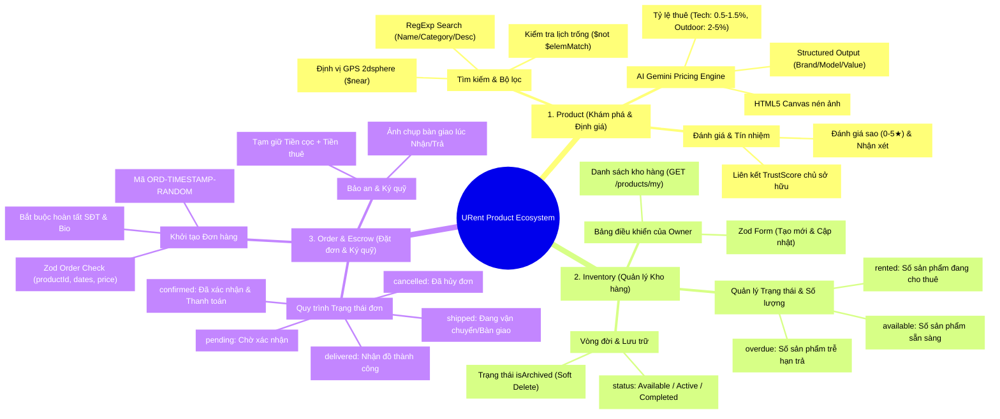
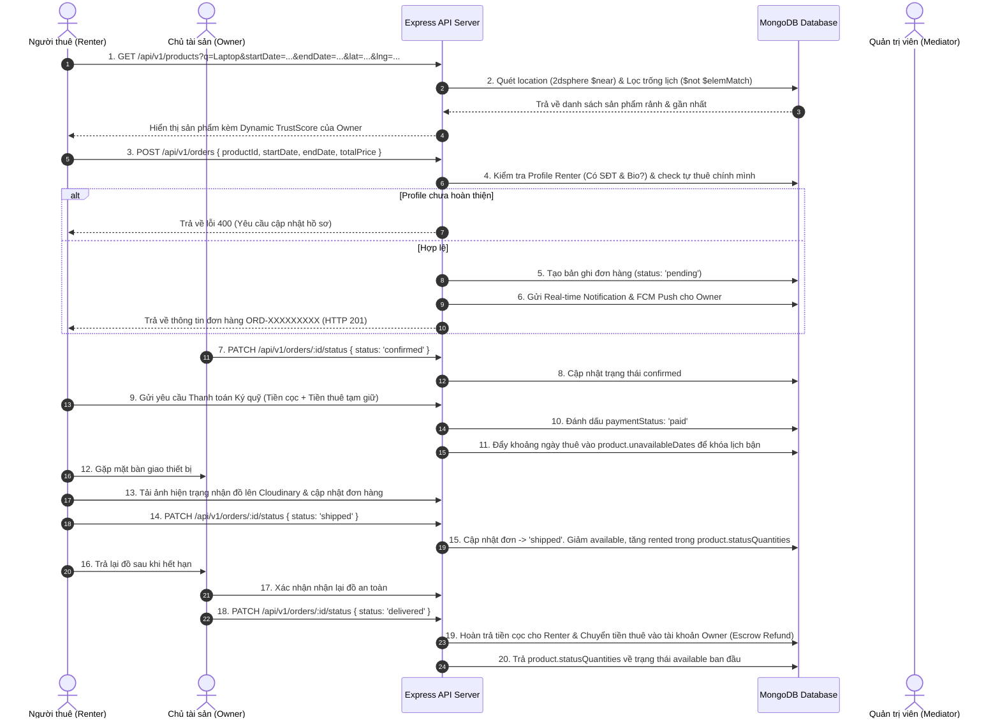
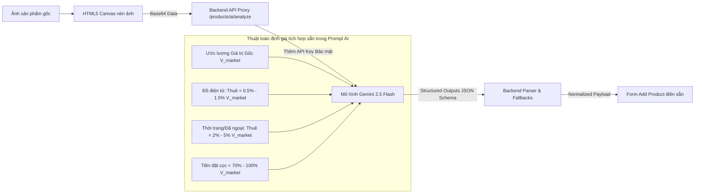

# 📦 Sơ Đồ Toàn Diện & Kiến Trúc - Hệ Sinh Thái Sản Phẩm (Product, Inventory, Order & Escrow)

Tài liệu này cung cấp một sơ đồ tư duy (Mindmap) hợp nhất, các biểu đồ luồng nghiệp vụ liên thông (Business Workflows & Sequence Diagrams) cùng thiết kế cơ sở dữ liệu chi tiết của bộ ba cốt lõi: **Product (Khám phá & Định giá)**, **Inventory (Quản lý Kho hàng)** và **Order (Quy trình Thuê & Ký quỹ Escrow)** trong hệ sinh thái URent.

---

## 🧠 1. Sơ Đồ Tư Duy Tổng Quan Hợp Nhất (Mermaid Mindmap)

Dưới đây là sơ đồ tư duy tổng thể liên kết chặt chẽ 3 khía cạnh: danh mục sản phẩm (Product), quản lý kho của chủ sở hữu (Inventory), và quy trình đặt đơn/bàn giao tài sản (Order & Escrow).



---

## 🔄 2. Biểu Đồ Quy Trình Nghiệp Vụ Liên Thông (Unified Business Workflow)

Dưới đây là biểu đồ quy trình trạng thái (State Diagram) mô tả mối quan hệ động giữa **Trạng thái Đơn hàng (Order Status)** ở phía người thuê và **Trạng thái Kho hàng (Inventory Quantities)** ở phía chủ sở hữu:

```mermaid
stateDiagram-v2
    [*] --> CreateProduct : Owner thêm sản phẩm (Có hỗ trợ Gemini AI gợi ý)
    CreateProduct --> ProductAvailable : status: 'Available' (available: 1, rented: 0)
    
    state ProductAvailable {
        [*] --> Idle : Chờ khách hàng thuê
        Idle --> SearchGeospatial : Renter tìm kiếm địa lý & khoảng ngày rảnh
    }
    
    ProductAvailable --> OrderPending : Renter tạo đơn (POST /api/v1/orders)
    note on OrderPending
        Order: status = 'pending', paymentStatus = 'unpaid'
        Renter bắt buộc phải hoàn thành profile (Số điện thoại & Bio)
    end note
    
    OrderPending --> OrderCancelled : Hủy đơn (Quá hạn thanh toán hoặc Renter/Owner hủy)
    OrderCancelled --> ProductAvailable : Hồi lại trạng thái trống lịch bận

    OrderPending --> OrderConfirmed : Owner duyệt & Renter thanh toán ký quỹ (Escrow)
    note on OrderConfirmed
        Order: status = 'confirmed', paymentStatus = 'paid'
        Hệ thống khóa lịch bận (lưu vào Product.unavailableDates)
    end note

    OrderConfirmed --> OrderShipped : Bàn giao thiết bị & Chụp ảnh hiện trạng (Handover Checkpoint)
    note on OrderShipped
        Order: status = 'shipped'
        Inventory thay đổi số lượng:
        - available = 0
        - rented = 1
    end note

    OrderShipped --> OrderDelivered : Renter xác nhận đã nhận sản phẩm hoạt động tốt
    note on OrderDelivered
        Order: status = 'delivered'
    end note

    OrderDelivered --> OrderReturned : Hết hạn thuê - Renter trả lại đồ & Chụp ảnh đối soát trả hàng
    OrderReturned --> EscrowRefund : Owner kiểm tra tài sản nguyên vẹn & Xác nhận trên app
    
    state EscrowRefund {
        [*] --> AutoRefund : Hệ thống hoàn trả tiền cọc cho Renter
        AutoRefund --> PayoutOwner : Giải ngân tiền thuê (trừ phí sàn) cho Owner
    }
    
    EscrowRefund --> OrderFinished : Giao dịch hoàn thành mỹ mãn
    OrderFinished --> ProductAvailable : available = 1, rented = 0 (Sẵn sàng cho lượt thuê mới)

    OrderDelivered --> DisputeState : Renter làm mất/hỏng đồ hoặc trả muộn ngày (Overdue)
    note on DisputeState
        Inventory:
        - overdue = 1
        Mediator (Admin) vào phòng tranh chấp,
        đối soát ảnh chụp Handover lúc Nhận vs Trả.
    end note
    DisputeState --> EscrowRefund : Admin phân xử khấu trừ tiền cọc tương ứng
```

---

## 📅 3. Luồng Giao Dịch Thuê & Ký Quỹ Chi Tiết (Escrow Rental Sequence Diagram)

Sơ đồ tuần tự chi tiết dưới đây thể hiện cách 3 thực thể **Renter**, **Owner**, và **Admin** tương tác với hệ thống backend qua các API của Product, Inventory, và Order:



---

## 🤖 4. Quy Trình AI Gemini Phân Tích & Định Giá (AI Gemini Pricing Pipeline)

Tích hợp AI giúp chuẩn hóa dữ liệu khi Chủ tài sản quản lý **Inventory** của họ. Thay vì nhập thủ công các thông số, AI sẽ quét ảnh để điền tự động:



---

## 🗃️ 5. Chi Tiết Cơ Sở Dữ Liệu Đồng Bộ (MongoDB Database Schema)

Thiết kế Database đảm bảo liên kết chặt chẽ giữa 3 bảng: `products`, `orders` và `users`.

### 5.1 Collection `products` (Kho hàng của Owner)
```json
{
  "_id": "ObjectId",
  "ownerId": { "type": "ObjectId", "ref": "User", "index": true },
  "name": { "type": "String", "required": true },
  "category": { "type": "String", "required": true },
  "price": { "type": "Number", "required": true }, // Giá thuê/ngày
  "status": { "type": "String", "enum": ["Available", "Active", "Completed"], "default": "Available" },
  "statusQuantities": {
    "available": { "type": "Number", "default": 1 },
    "rented": { "type": "Number", "default": 0 },
    "overdue": { "type": "Number", "default": 0 }
  },
  "isArchived": { "type": "Boolean", "default": false },
  "imageUrl": { "type": "String", "required": true },
  "description": ["Mảng các mô tả đặc điểm nổi bật"],
  "condition": { "type": "String", "default": "New" }, // New | 99% | 95% | Used
  "location": {
    "type": { "type": "String", "enum": ["Point"], "default": "Point" },
    "coordinates": [105.8342, 21.0278] // [Kinh độ lng, Vĩ độ lat] -> Index 2dsphere
  },
  "locationText": { "type": "String", "default": "Chưa cập nhật vị trí" },
  "unavailableDates": [
    {
      "startDate": "Date (Khoảng lịch đã bị đặt thuê)",
      "endDate": "Date"
    }
  ],
  "rating": { "type": "Number", "default": 0 },
  "reviewsCount": { "type": "Number", "default": 0 }
}
```

### 5.2 Collection `orders` (Giao dịch thuê & Ký quỹ)
```json
{
  "_id": "ObjectId",
  "orderCode": { "type": "String", "required": true, "unique": true }, // ORD-TIMESTAMP-RANDOM
  "productId": { "type": "ObjectId", "ref": "Product", "index": true },
  "productName": { "type": "String", "required": true },
  "ownerId": { "type": "ObjectId", "ref": "User", "index": true }, // Chủ sản phẩm (Nhận tiền thuê)
  "renterId": { "type": "ObjectId", "ref": "User", "index": true }, // Người đi thuê (Thanh toán cọc + thuê)
  "customerName": { "type": "String", "required": true },
  "startDate": { "type": "Date", "required": true },
  "endDate": { "type": "Date", "required": true },
  "totalPrice": { "type": "Number", "required": true }, // Tổng tiền thuê của cả kỳ hạn
  "status": { 
    "type": "String", 
    "enum": ["pending", "confirmed", "shipped", "delivered", "cancelled"], 
    "default": "pending" 
  },
  "paymentStatus": { "type": "String", "enum": ["unpaid", "paid"], "default": "unpaid" },
  "image": { "type": "String" }, // Đường dẫn ảnh chụp bàn giao lúc nhận/trả đồ
  "createdAt": "Date",
  "updatedAt": "Date"
}
```

---

## 🔒 6. Kiểm Định Phân Quyền & Ràng Buộc Nghiệp Vụ (API Validators & Guards)

Hệ thống thiết lập hàng rào bảo mật nghiêm ngặt để đảm bảo các giao dịch thuê đồ diễn ra an toàn, không có tài khoản ảo hoặc hành vi gian lận:

### 6.1 Ràng buộc khi Khởi tạo Đơn thuê (`createOrder`)
Phía Backend thực hiện các bước kiểm tra logic nghiệp vụ trước khi ghi nhận đơn hàng:
1.  **Kiểm tra Profile hợp lệ**: Renter bắt buộc phải có `phone` và `bio` trong DB. Tránh trường hợp renter thuê đồ giá trị cao nhưng không thể liên lạc được.
2.  **Kiểm tra tự thuê chính mình**:
    ```typescript
    if (product.ownerId && String(product.ownerId) === String(userId)) {
      throw new AppError(400, 'BAD_REQUEST', 'Bạn không thể tự thuê sản phẩm của chính mình');
    }
    ```
3.  **Xác thực Payload đầu vào qua Zod**:
    ```typescript
    export const createOrderSchema = z.object({
      body: z.object({
        productId: z.string().min(1),
        productName: z.string().min(1),
        startDate: z.string().datetime(),
        endDate: z.string().datetime(),
        totalPrice: z.number().min(0)
      })
    });
    ```

### 6.2 Bảo vệ định danh tài sản trị giá cao (eKYC Guard)
*   **eKYC Requirement**: Khi Owner đăng sản phẩm và gắn cờ giá trị cao, hệ thống kích hoạt chốt chặn eKYC. Chỉ những tài khoản Renter có trường `ekycStatus` đạt trạng thái `'APPROVED'` mới được phép khởi tạo đơn thuê (`POST /api/v1/orders`) cho sản phẩm đó.
*   **Đồng bộ TrustScore**: Sau khi đơn hàng kết thúc thành công và không phát sinh khiếu nại, điểm uy tín `trustScore` của Renter và Owner tự động được cộng điểm tích lũy, giúp tăng hạng tín nhiệm cho các lần giao dịch sau.

> [!TIP]
> **Đồng bộ thời gian thực**: Trạng thái đơn hàng thay đổi (`updateOrderStatus`) sẽ tự động kích hoạt dịch vụ `activity-notification.service.ts` để bắn thông báo in-app thời gian thực qua **Socket.IO** và thông báo đẩy ngoại tuyến qua **Firebase Cloud Messaging (FCM)** giúp cả hai bên luôn bám sát hiện trạng tài sản.
