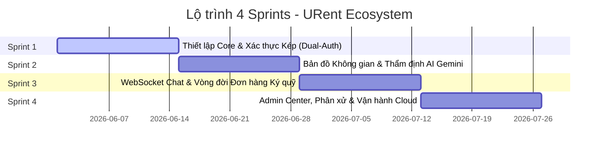
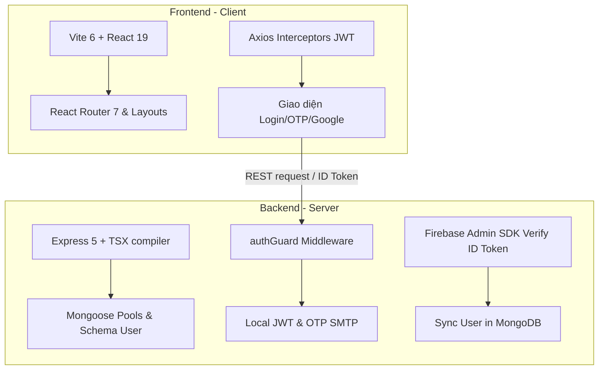
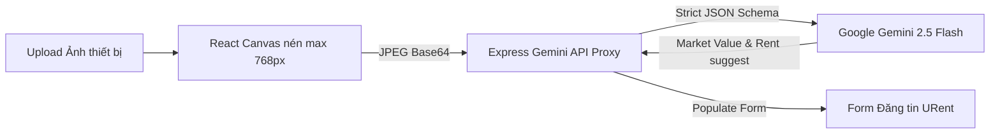
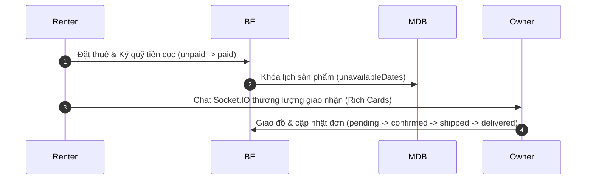
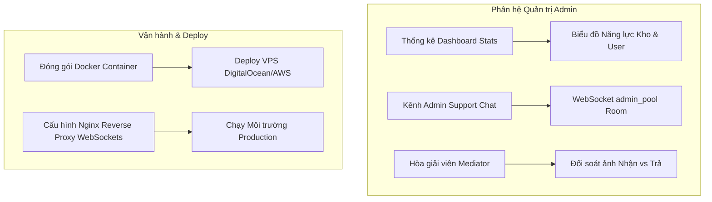

# 🗺️ URent - Kế hoạch Phát triển 4 Sprints (Comprehensive 4-Sprint Development Roadmap)

Kế hoạch phát triển này chia nhỏ toàn bộ vòng đời phát triển của hệ sinh thái **URent** thành **4 Sprints** bằng cơ chế Agile/Scrum. Mỗi sprint tập trung hoàn thành các lát cắt chức năng hoàn chỉnh từ tầng Cơ sở dữ liệu (Database), API Backend (Express), Real-time Layer (WebSockets) cho đến Giao diện người dùng (React 19 + TailwindCSS v4) nhằm đảm bảo hệ thống có thể kiểm thử và chạy được (runnable) ở cuối mỗi giai đoạn.

---

## 📊 Tổng quan Lộ trình 4 Sprints

---

## 🎯 Chi tiết Từng Sprint

### 📦 SPRINT 1: Nền tảng Hệ thống & Xác thực Kép Bảo mật (Core Foundation & Dual-Auth)

**Mục tiêu chính**: Thiết lập kiến trúc dự án Monorepo, cài đặt hạ tầng kết nối MongoDB Atlas tối ưu, hoàn thành hệ thống xác thực kép (Local Auth + OTP và Google OAuth + Firebase Admin SDK) và xây dựng giao diện cấu trúc layout tối ưu.

#### 1. Backend (urent-server)
*   **Cơ sở hạ tầng**: Tích hợp Express 5 chạy trực tiếp TypeScript thông qua compiler `tsx`. Thiết kế kiến trúc phân lớp sạch sẽ: `controllers`, `routes`, `models`, `middlewares`, `utils`.
*   **Kết nối dữ liệu**: Thiết lập Mongoose ODM với cơ chế tối ưu hóa Pool Connection (Lazy Connector) để chạy mượt mà trên cả máy chủ vật lý VPS lẫn môi trường Serverless (Vercel Functions).
*   **Database Schemas**: Thiết kế chi tiết [User Schema](file:///g:/DEV/mindx.x41.team4.URent/docs/DATABASE_SCHEMA.md#L46-L79) và [Settings Schema](file:///g:/DEV/mindx.x41.team4.URent/docs/DATABASE_SCHEMA.md#L23) với các chỉ mục tìm kiếm tối ưu (`email` unique case-insensitive, `phone` và `username` là `sparse: true` unique).
*   **Hệ thống Xác thực Kép (Dual-Auth)**:
    *   **Local Auth**: API đăng ký (`POST /auth/register`), tự động tạo mã OTP 6 chữ số gửi qua SMTP Nodemailer, băm mật khẩu bảo mật cao bằng `bcryptjs`. API xác thực OTP (`POST /auth/register/verify-otp`) kích hoạt tài khoản và cấp phát chữ ký số JWT.
    *   **Google OAuth**: Xây dựng middleware xác thực và đồng bộ tài khoản tự động. Giải mã Firebase ID Token từ Header bằng `verifyIdToken()` của Firebase Admin SDK, ánh xạ khớp với dữ liệu MongoDB hoặc tự tạo tài khoản mới nếu chưa tồn tại.
*   **API Documentation**: Thiết lập cấu hình Swagger quét route tự động và xuất giao diện tương tác `/api-docs`.

#### 2. Frontend (urent-client)
*   **Thiết lập dự án**: Khởi tạo Vite 6 + React 19 + TypeScript. Tích hợp TailwindCSS v4 làm ngôn ngữ thiết kế, tinh chỉnh bảng màu và hiệu ứng tối (Dark Mode), và biểu tượng Lucide React.
*   **Định tuyến & Layout**: Tích hợp React Router 7 để xử lý Nested Routing, tạo Router Guards để chặn các trang riêng tư đối với khách chưa đăng nhập.
*   **Hạ tầng mạng**: Cấu hình Axios Client tích hợp Interceptor tự động găm mã Authorization JWT vào request header, và xử lý tập trung lỗi hết hạn phiên làm việc (Session Expired).
*   **Giao diện Auth**: Hoàn thiện các trang: Đăng nhập (với nút Google Login), Đăng ký tài khoản, Xác minh mã OTP, Quên/Khôi phục mật khẩu.

#### 🏁 Mốc Bàn Giao Sprint 1 (Key Deliverables)
- [x] Người dùng đăng ký/đăng nhập thành công bằng email + nhận OTP mã 6 chữ số hoạt động thực tế.
- [x] Người dùng đăng nhập trực tiếp một chạm bằng Google Account.
- [x] API Swagger hiển thị tài liệu chuẩn hóa, toàn bộ endpoint Auth đều được kiểm tra chặt chẽ.

---

### 🗺️ SPRINT 2: Khám phá Địa lý & Thẩm định Giá bằng AI (Geospatial & Gemini Pricing)

**Mục tiêu chính**: Hiện thực hóa việc tạo kho lưu trữ sản phẩm, tích hợp tìm kiếm không gian địa lý dựa trên bản đồ Google Maps và áp dụng Trí tuệ Nhân tạo Google Gemini 2.5 Flash để thẩm định giá, gợi ý tiền cọc tự động thông qua ảnh chụp.

#### 1. Backend (urent-server)
*   **Database Schemas**: Triển khai [Product Schema](file:///g:/DEV/mindx.x41.team4.URent/docs/DATABASE_SCHEMA.md#L82-L116) cấu hình chỉ mục địa lý không gian `2dsphere` trên tọa độ `location.coordinates` (`[longitude, latitude]`).
*   **Tải ảnh Media**: Xây dựng controller proxy tích hợp dịch vụ lưu trữ đám mây Cloudinary, hỗ trợ upload ảnh sản phẩm từ Client và trả về link CDN tối ưu.
*   **Listing REST APIs**: Viết trọn bộ API CRUD sản phẩm (`/api/v1/products`), hỗ trợ phân trang và tìm kiếm theo bộ lọc danh mục.
*   **Tìm kiếm Địa lý (Geospatial API)**: Endpoint `/api/v1/products/search-near` thực hiện truy vấn tối ưu bằng cú pháp `$nearSphere` hoặc `$geoWithin` để lọc ra các sản phẩm trong bán kính tùy chọn xung quanh vị trí người dùng.
*   **Gemini AI Proxy Engine**:
    *   Xây dựng API `/api/v1/urent-ai/analyze` làm cầu nối bảo mật gọi API Google Gemini 2.5 Flash.
    *   Áp dụng tính năng **Structured Outputs** bắt buộc Gemini trả về dữ liệu tuân thủ nghiêm ngặt định dạng JSON Schema: thương hiệu, mẫu mã, độ mới (%), định giá thị trường ($V_{\text{market}}$), đề xuất giá thuê ngày ($0.5\% - 1.5\%$ cho đồ điện tử; $2\% - 5\%$ cho dã ngoại/thời trang), và đề xuất tiền đặt cọc an toàn ($70\% - 100\%$).

#### 2. Frontend (urent-client)
*   **Dashboard & Listing Feed**: Trang chủ hiển thị danh sách sản phẩm đẹp mắt, bộ lọc danh mục trực quan ("Điện tử & Công nghệ", "Du lịch & Dã ngoại", "Đồ dùng học tập", "Thời trang & Đời sống").
*   **Bản đồ Tìm kiếm Không gian**: Nhúng Google Maps API thông qua `@react-google-maps/api`. Khi người dùng kéo bản đồ hoặc tìm kiếm vị trí, các marker đại diện cho sản phẩm sẽ hiển thị sống động. Click vào marker mở nhanh thông tin pop-up sản phẩm.
*   **Trình Đăng Tin Thông Minh (Gemini Magic Wizard)**:
    *   Thiết kế form đăng sản phẩm với hiệu ứng micro-animations.
    *   Tích hợp xử lý nén ảnh ngay tại Client qua React Canvas API (giới hạn max 768px, chuyển định dạng JPEG) để giảm thiểu tối đa dung lượng tải lên và tránh lỗi CORS.
    *   Khi người dùng upload ảnh, form tự động gọi Gemini API phân tích, hiển thị hiệu ứng "AI đang phân tích..." và tự động điền các thông tin gợi ý (Tên, hãng, giá thuê, tiền cọc) vào các ô nhập liệu giúp nâng cao trải nghiệm người dùng.
    *   Tích hợp lưu trữ đệm `sessionStorage` để không gọi Gemini trùng lặp khi người dùng điều chỉnh form.

#### 🏁 Mốc Bàn Giao Sprint 2 (Key Deliverables)
- [x] Đăng tin cho thuê mới hoàn chỉnh, tự động điền thông tin và đề xuất giá thông minh bằng ảnh chụp qua AI Gemini.
- [x] Trang khám phá bản đồ tương tác định vị chính xác khoảng cách các đồ dùng xung quanh người dùng (tính toán bằng km thực tế).

---

### 💬 SPRINT 3: Chat Thời gian thực & Quy trình Đơn hàng Ký quỹ (WebSockets & Escrow Booking)

**Mục tiêu chính**: Tích hợp kênh truyền thông trực tiếp thông qua WebSocket (Socket.IO) bảo mật, và xây dựng quy trình đặt thuê đồ ký quỹ chặt chẽ, quản lý lịch trống tự động và chuyển trạng thái đơn hàng.

#### 1. Backend (urent-server)
*   **Hạ tầng WebSocket**: Khởi tạo Server Socket.IO, găm chặt middleware xác thực token (handshake auth) để bảo vệ kết nối. Phân chia kênh chat theo các phòng độc lập `conversationId` để cô lập dữ liệu.
*   **Database Schemas**: Thiết lập chi tiết bộ ba schema chat: [Conversation](file:///g:/DEV/mindx.x41.team4.URent/docs/DATABASE_SCHEMA.md#L146-L160) (loại `one_to_one` hoặc `support`), [ConversationParticipant](file:///g:/DEV/mindx.x41.team4.URent/docs/DATABASE_SCHEMA.md#L162-L177) (quản lý `unreadCount` badge và `lastReadAt`), và [Message](file:///g:/DEV/mindx.x41.team4.URent/docs/DATABASE_SCHEMA.md#L179-L192) (loại `TEXT`, `PRODUCT` snapshot, hoặc `LOCATION` tọa độ).
*   **Quy trình Giao tiếp**:
    *   Tạo API gửi tin nhắn, tự động cập nhật `lastMessageAt` và tăng chỉ số tin nhắn chưa đọc `unreadCount` cho đối phương.
    *   Phát sự kiện WebSocket thời gian thực `conversation.message.created` tới phòng chat chỉ định.
    *   Sự kiện `conversation.read.updated` kích hoạt khi người dùng đọc tin nhắn, ngay lập tức xóa bỏ unread badge của họ.
*   **Database Schemas - Đơn hàng**: Định nghĩa chi tiết [Order Schema](file:///g:/DEV/mindx.x41.team4.URent/docs/DATABASE_SCHEMA.md#L119-L141) tạo mã hóa đơn ngẫu nhiên `orderCode`, lưu dấu snapshot sản phẩm, quản lý lịch ngày thuê (`startDate`, `endDate`) và trạng thái hợp đồng.
*   **Quy trình Đơn hàng Ký quỹ (Escrow Booking Pipeline)**:
    *   API Đặt lịch thuê (`POST /api/v1/orders`): Kiểm tra xem lịch chọn có bị trùng hay không, tiến hành khóa tạm thời lịch (`unavailableDates`) trên Product.
    *   API Cập nhật trạng thái giao nhận (`POST /api/v1/orders/:id/status`): Vòng đời đơn gồm `pending` (Chờ duyệt) $\rightarrow$ `confirmed` (Đã duyệt) $\rightarrow$ `shipped` (Đang giao) $\rightarrow$ `delivered` (Đã nhận đồ / Bắt đầu thuê) $\rightarrow$ `completed` (Đã trả đồ) hoặc `cancelled` (Hủy bỏ giải phóng lịch).
    *   Thanh toán ký quỹ: Quản lý trạng thái dòng tiền cọc an toàn (`paymentStatus` gồm `unpaid` và `paid`).

#### 2. Frontend (urent-client)
*   **Giao diện Chat Real-Time**:
    *   Khung chat trơn tru, hiển thị bong bóng tin nhắn trái/phải, hiển thị trạng thái "đang nhập tin nhắn...", chỉ báo tích xanh "đã đọc".
    *   Hỗ trợ hiển thị tin nhắn đính kèm Rich Metadata: Nhấn gửi vị trí hiện tại (hiển thị bản đồ nhỏ) hoặc gửi kèm Thẻ sản phẩm cho thuê trực tiếp để thương lượng dễ dàng.
    *   Badge thông báo số lượng tin nhắn chưa đọc hiển thị nổi bật trên thanh điều hướng.
*   **Giao diện Đặt lịch & Hợp đồng**:
    *   Trang chi tiết sản phẩm tích hợp bộ lịch chọn ngày thuê thông minh, tự động vô hiệu hóa các ngày đã bị thuê trước đó (`unavailableDates`).
    *   Màn hình tính toán tổng chi phí thuê + tiền cọc ký quỹ tự động và xác nhận cam kết hợp đồng.
*   **Trang Quản lý Đơn hàng (Order Center)**:
    *   Bảng điều khiển dành cho **Người đi thuê (Renter)**: Xem các đơn hàng đã đặt, lịch sử giao dịch cọc, theo dõi tình trạng giao nhận.
    *   Bảng điều khiển dành cho **Chủ đồ (Owner)**: Phê duyệt đơn đặt hàng, cập nhật các trạng thái giao hàng, xác nhận đã trả đồ hoàn trả cọc.

#### 🏁 Mốc Bàn Giao Sprint 3 (Key Deliverables)
- [x] Trải nghiệm nhắn tin trực tuyến thời gian thực mượt mà giữa người thuê và chủ đồ, hiển thị badge tin nhắn mới tức thời.
- [x] Thực hiện đặt lịch thuê đồ, hệ thống tự động tính toán tổng tiền và khóa cứng lịch của sản phẩm trên lịch chung, quản lý vòng đời đơn đặt.

---

### 🛡️ SPRINT 4: Trạm Quản trị Admin, Phân xử Tranh chấp & Vận hành Cloud (Admin Hub & Deploy)

**Mục tiêu chính**: Xây dựng Bảng điều khiển Quản trị (Admin Dashboard) bảo mật chặt chẽ bằng RBAC, hệ thống hòa giải tranh chấp ký quỹ bằng đối soát ảnh bàn giao, phòng chat hỗ trợ trực tuyến, gửi push notifications Firebase Cloud Messaging (FCM) và đóng gói docker/deploy hạ tầng.

#### 1. Backend (urent-server)
*   **Hàng rào Bảo vệ Admin (RBAC Gates)**: Thiết lập middleware [adminGuard](file:///g:/DEV/mindx.x41.team4.URent/docs/ADMIN_SYSTEM_ARCHITECTURE.md#L133-L145) chặn các REST API nhạy cảm, và hàm tùy biến linh hoạt [requireRole](file:///g:/DEV/mindx.x41.team4.URent/docs/ADMIN_SYSTEM_ARCHITECTURE.md#L147-L161) cấp quyền cho Mediator/Admin.
*   **Dashboard Stats Compiler**: Endpoint `/api/v1/admin/dashboard-stats` tổng hợp thông số song song bằng MongoDB aggregation: lượng user online, số đơn hàng đang tranh chấp, tỷ lệ đơn thành công, tổng kho tài sản đang cho thuê.
*   **WebSocket Customer Support Room**: Cơ chế kết nối Live Support đẩy yêu cầu của khách vào hàng đợi WebSocket `room:admin_pool`, phát tín hiệu cho toàn bộ Admin online có thể nhấp nhận cuộc gọi để bắt đầu chat hỗ trợ.
*   **Escrow Dispute Mediator Center (Hòa giải tranh chấp)**:
    *   Khi có khiếu nại, trạng thái Order chuyển thành `disputed`.
    *   API cho phép Admin đóng vai trò là Mediator truy xuất lịch sử chat của cặp user (`pairKey` query), lấy toàn bộ tin nhắn và ảnh chụp bàn giao.
    *   API Phân xử tài chính: Giải ngân một phần tiền cọc cho Renter hoặc đền bù cho Owner tùy thuộc quyết định phân xử, tự động trừ điểm tín nhiệm `trustScore` của tài khoản vi phạm.
*   **Audit Logging**: Mọi hành vi quản trị/phân xử được tự động ghi lại bất biến vào [ActivityLog Collection](file:///g:/DEV/mindx.x41.team4.URent/docs/DATABASE_SCHEMA.md#L215-L232) để phục vụ thanh tra tài chính.
*   **FCM Push Notification Service**: Tích hợp Firebase Admin SDK để thu thập mã thiết bị `fcmtokens` từ trình duyệt của người dùng, thực hiện đẩy thông báo tự động khi có tin nhắn mới hoặc đơn hàng thay đổi trạng thái.

#### 2. Frontend (urent-client)
*   **Admin Dashboard UI**:
    *   Trang tổng hợp chỉ số với các biểu đồ trực quan (nhờ thư viện biểu đồ nhẹ) về sức khỏe hệ thống và phân bổ thiết bị.
    *   Danh sách quản trị người dùng: Thay đổi điểm uy tín `trustScore`, xác nhận thông tin định danh eKYC.
*   **Live Chat Support Portal**: Trang chuyên biệt của Admin để quản lý danh sách cuộc gọi hỗ trợ trực tuyến, nhấp chat trực tiếp hỗ trợ khách hàng.
*   **Escrow Dispute Mediation View**: Màn hình đối chứng trực quan thiết kế chia đôi màn hình: hiển thị song song ảnh chụp bàn giao lúc nhận (Pickup Photo) và ảnh chụp bàn giao lúc trả (Return Photo). Admin có thanh kéo điều chỉnh tỷ lệ chia tiền cọc và nút bấm ra phán quyết phân tách ký quỹ.
*   **Push Notification Prompt**: Hiển thị popup xin quyền thông báo trên trình duyệt, lưu `fcmtoken` lên server trên thiết bị Client.

#### 3. Triển khai & Tối ưu hóa (DevOps & Production)
*   **Kiểm thử E2E**: Thực hiện chạy tự động toàn bộ Unit Tests với Vitest và kiểm thử API Gateway bằng Swagger, bảo đảm không có lỗi bảo mật hoặc rò rỉ bộ nhớ.
*   **Dockerization**: Viết Dockerfile tối ưu hóa cấu trúc nhiều lớp (multi-stage build) để nén nhỏ dung lượng container cho Backend và Frontend.
*   **Triển khai thực tế (Production Launch)**:
    *   **Frontend**: Cấu hình file `vercel.json` định tuyến SPA chuẩn xác và deploy lên hệ thống CDN Vercel.
    *   **Backend & WebSocket**: Triển khai Container Docker lên máy chủ VPS (DigitalOcean / EC2 AWS), thiết lập máy chủ Nginx Reverse Proxy nâng cấp giao thức HTTP/1.1 lên WebSocket Upgrade.

#### 🏁 Mốc Bàn Giao Sprint 4 (Key Deliverables)
- [x] Admin giám sát toàn diện hoạt động, hỗ trợ trực tuyến live chat và phân quyết tranh chấp ký quỹ chuyên nghiệp qua ảnh chụp thực tế.
- [x] Toàn bộ hệ thống chạy ổn định 24/7 trên tên miền thật, gửi thông báo đẩy FCM hoạt động mượt mà.

---

## 📈 Kế hoạch Phân bổ Tài nguyên & Nhân sự đề xuất

Để hoàn thành 4 sprints này tốt nhất, nhóm của bạn nên có các vai trò sau phối hợp nhịp nhàng:

| Vai trò | Phụ trách chính | Nhiệm vụ Sơ bộ |
| :--- | :--- | :--- |
| **Frontend Engineer** | `urent-client` | Giao diện Responsive Tailwind v4, Tích hợp Google Maps API, Quản lý WebSocket Client, Canvas nén ảnh. |
| **Backend Engineer** | `urent-server` | Xây dựng REST APIs, Thiết lập Socket.IO Server Rooms, Quản lý MongoDB indexes, Tích hợp Firebase Admin. |
| **DevOps / AI Architect** | Hạ tầng & API Gemini | Cấu hình Prompt Structured Outputs cho Gemini 2.5 Flash, Cloudinary Media CDN, Thiết lập Nginx WS Proxy & Docker VPS. |
| **QA / Product Owner** | Thử nghiệm & Vận hành | Viết Unit Test Vitest, Kiểm thử các kịch bản hòa giải ký quỹ, Đối soát luồng nghiệp vụ. |

---

> [!NOTE]
> Kế hoạch 4 Sprints này được thiết kế theo hình thức cuốn chiếu, nghĩa là kết thúc mỗi Sprint, hệ thống luôn ở trạng thái **Sẵn sàng Demo** cho khách hàng hoặc nhà đầu tư xem những gì đã thực hiện được, thay vì chờ đến cuối dự án mới tích hợp.
