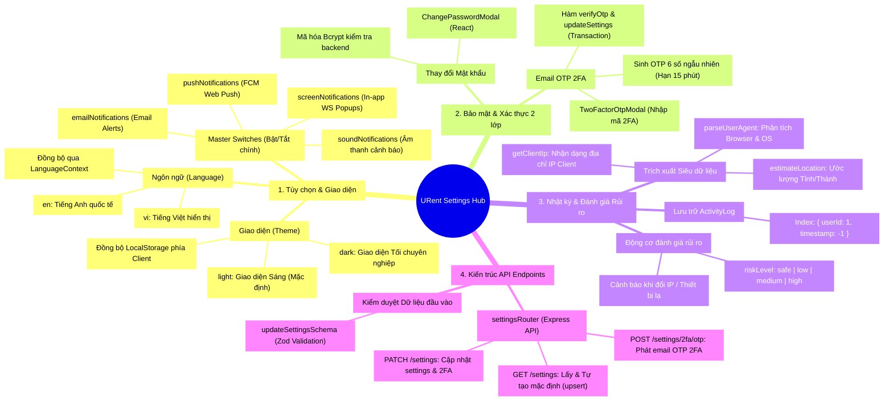
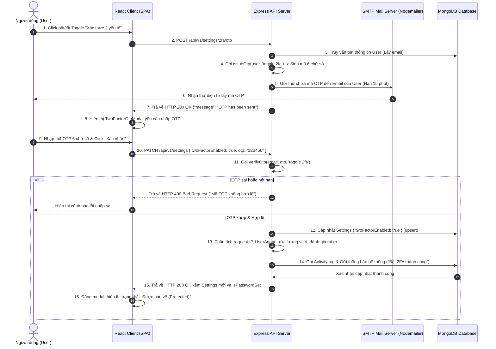
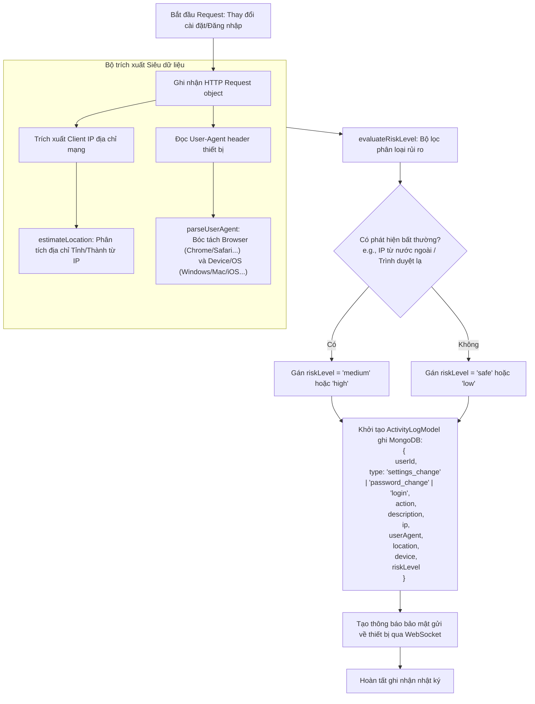

# ⚙️ Sơ Đồ Toàn Diện & Kiến Trúc - Phân Hệ Settings & Security (URent Ecosystem)

Tài liệu này trình bày sơ đồ tư duy (Mindmap), các biểu đồ luồng nghiệp vụ bảo mật (Sequence & Flowcharts) cùng thiết kế cơ sở dữ liệu chi tiết của phân hệ **Settings (Thiết lập tài khoản)**, **Xác thực 2 yếu tố (2FA Email OTP)** và **Hệ thống Nhật ký Hoạt động (Activity Logs & Risk Assessment)** trong hệ sinh thái URent.

---

## 🧠 1. Sơ Đồ Tư Duy Tổng Quan Phân Hệ Settings (Mermaid Mindmap)

Dưới đây là sơ đồ tư duy phân tách các khía cạnh: **Tùy chọn hiển thị (Preferences)**, **Tiêu chuẩn bảo mật (Security & 2FA)**, **Nhật ký hoạt động (Activity Logs)** và **Kiến trúc phân phối dữ liệu**.



---

## 🔒 2. Luồng Kích Hoạt Xác Thực 2 Lớp (2FA State Sequence Diagram)

Quá trình kích hoạt hoặc hủy kích hoạt **Xác thực 2 lớp (2FA)** được bảo vệ tuyệt đối để tránh việc tài khoản bị chiếm đoạt. Hệ thống yêu cầu một quy trình xác minh 2 bước qua mã OTP gửi tới Email đã đăng ký của người dùng:



---

## 🛡️ 3. Luồng Ghi Nhận Lịch Sử Hoạt Động & Đánh Giá Rủi Ro (Activity Logger)

Mỗi khi người dùng đăng nhập, đổi mật khẩu hoặc sửa đổi các thiết lập bảo mật quan trọng, hệ thống tự động ghi lại nhật ký hoạt động chi tiết để hỗ trợ đối soát bảo mật.



---

## 🗃️ 4. Chi Tiết Thiết Kế MongoDB Collection Schemas

Phân hệ Settings và Nhật ký bảo mật được lưu trữ tại 2 Collections độc lập liên kết thông qua trường `userId`:

### 4.1 Collection `settings` (Thiết lập cấu hình)
```json
{
  "_id": "ObjectId",
  "userId": { "type": "ObjectId", "ref": "User", "required": true, "unique": true, "index": true },
  "theme": { "type": "String", "enum": ["light", "dark"], "default": "light" },
  "language": { "type": "String", "enum": ["vi", "en"], "default": "vi" },
  "emailNotifications": { "type": "Boolean", "default": true }, // Master Switch Email
  "screenNotifications": { "type": "Boolean", "default": true }, // Master Switch In-App (WS)
  "pushNotifications": { "type": "Boolean", "default": true },  // Master Switch Web Push (FCM)
  "soundNotifications": { "type": "Boolean", "default": true },
  "twoFactorEnabled": { "type": "Boolean", "default": false },   // Trạng thái bật/tắt 2FA
  "preferences": {
    // Chi tiết kênh gửi cho từng nhóm thông báo:
    "orderUpdates": { "email": true, "push": true, "inApp": true },
    "chatMessages": { "email": true, "push": true, "inApp": true },
    "promotions": { "email": true, "push": true, "inApp": true },
    "systemAlerts": { "email": true, "push": true, "inApp": true }
  },
  "createdAt": "Date",
  "updatedAt": "Date"
}
```

### 4.2 Collection `activitylogs` (Nhật ký lịch sử hoạt động)
```json
{
  "_id": "ObjectId",
  "userId": { "type": "ObjectId", "ref": "User", "index": true },
  "action": { "type": "String", "required": true }, // Tiêu đề hành động ngắn gọn
  "description": { "type": "String", "required": true }, // Chi tiết hoạt động
  "timestamp": { "type": "Date", "default": "Date.now" },
  "type": { 
    "type": "String", 
    "enum": ["auth", "update", "message", "login", "logout", "profile_update", "password_change", "settings_change"], 
    "required": true 
  },
  "notificationId": { "type": "ObjectId", "ref": "Notification" }, // Liên kết nếu hành động này kích hoạt thông báo
  "eventKey": { "type": "String" },
  "ip": { "type": "String" }, // Địa chỉ IP thực tế của request
  "userAgent": { "type": "String" }, // Toàn bộ chuỗi User-Agent header
  "location": { "type": "String" }, // Vị trí ước lượng (Ví dụ: "Hanoi, Vietnam")
  "device": { "type": "String" }, // Thiết bị phân tích được (Ví dụ: "Chrome / Windows 10")
  "riskLevel": { "type": "String", "enum": ["safe", "low", "medium", "high"], "default": "safe" },
  "createdAt": "Date",
  "updatedAt": "Date"
}
```

---

## 🔒 5. Kiểm Định & Flatten Dữ Liệu Phía Backend

Khi người dùng thực hiện cập nhật các trường cấu hình lồng nhau (Nested Fields như `preferences.orderUpdates.email`), Backend áp dụng kỹ thuật **Flatten Object** để tối ưu hóa truy vấn cập nhật và tránh ghi đè các cấu hình tùy chọn khác:

### 5.1 Thuật toán Flatten Object (Phẳng hóa dữ liệu)
Thay vì gửi toàn bộ Object `preferences` lên MongoDB gây mất mát các tùy chọn con chưa cập nhật, hàm `flattenObject` chuyển đổi:
```javascript
// Dữ liệu đầu vào:
{
  preferences: {
    orderUpdates: {
      email: false
    }
  }
}

// Dữ liệu sau khi Phẳng hóa (Flattened):
{
  "preferences.orderUpdates.email": false
}
```
*   **Lợi ích**: Khi chạy lệnh cập nhật `$set` của MongoDB, nó chỉ thay đổi chính xác thuộc tính `preferences.orderUpdates.email` của User mà không làm ảnh hưởng hay ghi đè các cài đặt khác như `preferences.chatMessages` hay `preferences.systemAlerts`.

### 5.2 Ràng buộc Cập nhật từ Zod Validator
Dữ liệu gửi từ Client lên được đi qua middleware kiểm định `validateBody` sử dụng Zod schema `updateSettingsSchema`:
```typescript
export const updateSettingsSchema = z.object({
  theme: z.enum(['light', 'dark']).optional(),
  language: z.enum(['vi', 'en']).optional(),
  emailNotifications: z.boolean().optional(),
  screenNotifications: z.boolean().optional(),
  pushNotifications: z.boolean().optional(),
  soundNotifications: z.boolean().optional(),
  twoFactorEnabled: z.boolean().optional(),
  otp: z.string().length(6, 'Mã OTP phải dài đúng 6 số').optional(),
  preferences: z.object({
    orderUpdates: z.object({ email: z.boolean().optional(), push: z.boolean().optional(), inApp: z.boolean().optional() }).optional(),
    chatMessages: z.object({ email: z.boolean().optional(), push: z.boolean().optional(), inApp: z.boolean().optional() }).optional(),
    promotions: z.object({ email: z.boolean().optional(), push: z.boolean().optional(), inApp: z.boolean().optional() }).optional(),
    systemAlerts: z.object({ email: z.boolean().optional(), push: z.boolean().optional(), inApp: z.boolean().optional() }).optional(),
  }).optional()
});
```

> [!NOTE]
> **Upsert-Safe**: Trong hàm `updateSettings`, Backend loại bỏ trường `twoFactorEnabled` khỏi giá trị mặc định `$setOnInsert` khi nó đã có mặt trong `$set` để tránh lỗi xung đột đường dẫn dữ liệu (path-conflict) của MongoDB, đảm bảo hệ thống tự tạo thiết lập mặc định (Upsert) an toàn kể cả đối với các tài khoản mới đăng ký chưa từng truy cập mục Cài đặt.
