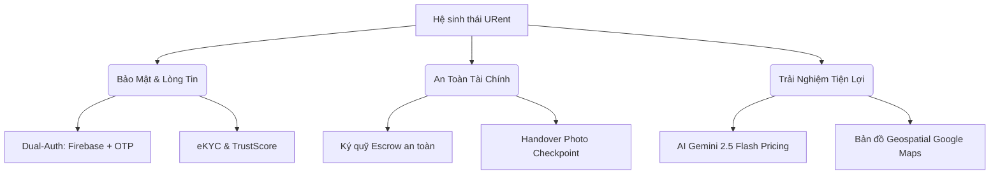
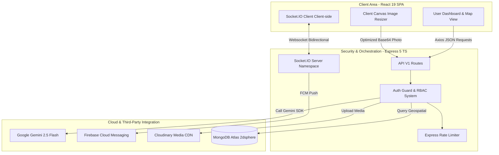
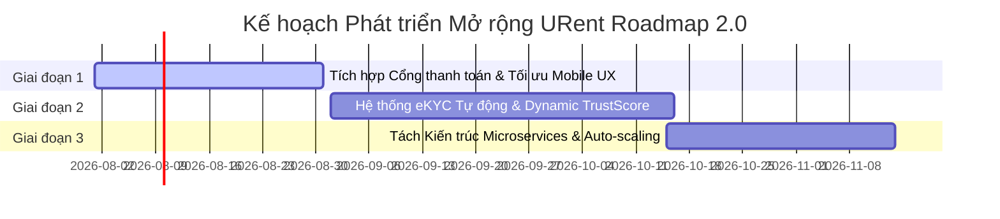

# 🚀 URent - Tổng Kết & Định Hướng Tương Lai (Project Summary & Future Outlook)

> [!NOTE]  
> Tài liệu này được biên soạn nhằm tổng hợp toàn bộ thành quả công nghệ vượt bậc của hệ sinh thái **URent** sau chuỗi hành trình thiết kế hệ thống và lập roadmap 4 sprints, đồng thời mở ra tầm nhìn chiến lược dài hạn cho sự phát triển của nền tảng trong tương lai.

---

## 🧭 1. Tổng Quan & Tầm Nhìn Chiến Lược của URent

**URent** không chỉ đơn thuần là một nền tảng cho thuê đồ dùng; đây là một **Hệ sinh thái Thuê và Cho thuê đa mục đích thế hệ mới** giải quyết triệt để 3 bài toán nhức nhối của thị trường chia sẻ tài sản hiện nay:
1. **Lòng tin (Trust)**: Giải quyết qua cơ chế xác thực kép (Dual-Auth), định danh eKYC và thang điểm uy tín động **TrustScore**.
2. **Sự an toàn tài chính (Financial Security)**: Bảo vệ cả chủ tài sản (Owner) và người thuê (Renter) bằng quy trình đặt cọc giữ quỹ trung gian **(Escrow Booking Pipeline)** phối hợp đối soát ảnh bàn giao **(Handover Checkpoint)**.
3. **Sự tiện lợi và tối ưu giá (Convenience & Pricing)**: Loại bỏ các thao tác đăng tin thủ công rườm rà bằng **AI Gemini Vision Engine** tự động định giá và tối ưu hóa tìm kiếm không gian địa lý **(Geospatial Discovery)** thực tế.



---

## 🛠️ 2. Tổng Kết Kiến Trúc & Tính Năng Công Nghệ Đã Đạt Được

Trải qua lộ trình hoạch định 4 Sprints chặt chẽ, URent đã xây dựng một nền tảng kỹ thuật vững chắc với mô hình **Monorepo** phối hợp chặt chẽ giữa Frontend Client và Backend Server thông qua cấu trúc thư mục tối ưu:

### 2.1 Bản đồ Công nghệ Tối tân (Advanced Tech Stack)

| Thành phần | Công nghệ tích hợp | Vai trò / Tính năng nổi bật |
| :--- | :--- | :--- |
| **Frontend Client** | React 19, Vite 6, TailwindCSS v4, React Router 7, Axios Interceptors | Giao diện hiện đại, Dark Mode native, quản lý phiên và xử lý nén ảnh ngay tại trình duyệt client. |
| **Backend Server** | Node.js 20+, Express 5, TypeScript (tsx compiler), Mongoose 8 | API Gateway hiệu năng cao, tối ưu kết nối Database Lazy Pooling cho VPS & Serverless. |
| **Real-time Layer** | Socket.IO 4 | WebSocket an toàn, phân tách kênh trò chuyện, thông tin trạng thái hoạt động tức thì. |
| **AI Vision Engine** | Google Gemini 2.5 Flash API | Nhận diện hình ảnh sản phẩm, xuất dữ liệu JSON cấu trúc chuẩn định sẵn (Structured Outputs). |
| **Cloud Services** | Cloudinary CDN, Firebase SDK & Admin SDK, SMTP Nodemailer | Lưu trữ đa phương tiện, xác thực Firebase OAuth Google, OTP SMS/Email. |

### 2.2 Sơ đồ Luồng Hoạt động Tổng thể Hệ thống

Dưới đây là mô hình phân tích kiến trúc tương tác đa lớp của URent từ tầng giao diện người dùng đến các dịch vụ bên thứ ba:



---

## 💎 3. Những Đột Phá Kỹ Thuật Đáng Giá Nhất

Nền tảng URent sở hữu 4 đột phá công nghệ cốt lõi giúp dự án vượt qua các ứng dụng cho thuê thông thường trên thị trường:

### 💡 Đột phá 1: Trình Đăng Tin Tự Động Định Giá "Gemini Magic Wizard"
*   **Giải pháp:** Thay vì bắt người dùng điền hàng chục trường thông tin, họ chỉ cần chụp ảnh thiết bị.
*   **Kỹ thuật:** Ảnh được nén bằng **React Canvas API** tại client xuống mức tối đa 768px (JPEG chất lượng 0.8) trước khi gửi. Gemini 2.5 Flash phân tích qua tính năng **Structured Outputs (JSON Schema)** và trả về:
    *   Tên sản phẩm, Hãng, Model, Tình trạng hao mòn thực tế.
    *   Giá trị tài sản thực tế ($V_{market}$).
    *   Gợi ý giá thuê tối ưu theo ngày và giá tiền cọc an toàn.
*   **Trải nghiệm người dùng:** Điền tự động 80% form đăng tin trong vòng chưa đầy 3 giây, loại bỏ rào cản thao tác đăng ký tin cũ kỹ.

### 🔒 Đột phá 2: Quy trình Ký quỹ Kép (Double Escrow & Handover Checkpoint)
*   **Giải pháp:** Loại bỏ vấn nạn "bùng tiền cọc" từ phía Chủ đồ hoặc "hư hại đồ trốn tránh" từ phía Người đi thuê.
*   **Kỹ thuật:** 
    *   Tiền thuê và cọc được tạm khóa tại hệ thống URent (Escrow Wallet) khi bắt đầu đơn đặt.
    *   **Handover Checkpoint:** Khi nhận đồ và trả đồ, hai bên bắt buộc phải upload ảnh chụp hiện trạng lên hệ thống. Ảnh này được đóng dấu timestamp bất biến và liên kết trực tiếp vào mã đơn hàng `orderCode`.
    *   Nếu có tranh chấp xảy ra, trạng thái đơn sẽ chuyển thành `disputed`. Hệ thống mở ra phòng phân giải **Mediator Room** hỗ trợ Admin xem xét đối chứng ảnh chụp bàn giao và quyết định tỷ lệ phân chia tiền cọc hoàn lại một cách công bằng nhất.

### 🗺️ Đột phá 3: Tìm kiếm Bản đồ Không gian Địa lý (Geospatial Discovery)
*   **Giải pháp:** Người dùng thuê đồ ưu tiên khoảng cách gần để tối ưu chi phí vận chuyển.
*   **Kỹ thuật:** URent nhúng Google Maps API và cấu hình chỉ mục địa lý không gian `2dsphere` của MongoDB Atlas trên dữ liệu tọa độ `[longitude, latitude]`. 
*   Các truy vấn gần kề (`$nearSphere` kết hợp `$maxDistance`) được tối ưu hóa chỉ mục cho tốc độ phản hồi cực nhanh dưới 50ms, hiển thị trực quan các bong bóng sản phẩm (markers) trên bản đồ thời gian thực.

### 💬 Đột phá 4: Nhắn tin Thời gian thực Tích hợp Tiện ích Đa nhiệm
*   **Giải pháp:** Trao đổi thỏa thuận nhanh chóng ngay trên ứng dụng mà không cần qua Zalo/Facebook.
*   **Kỹ thuật:** Socket.IO hoạt động song song với Express. Khi hai người dùng kết nối, họ được đưa vào một `conversationId` bảo mật. 
*   Hệ thống tin nhắn hỗ trợ đính kèm **Rich Cards** (Thẻ thông tin sản phẩm và bản đồ định vị GPS nhỏ trực quan ngay trong khung chat) và đếm số tin nhắn chưa đọc (Unread Badges) đồng bộ tức thì trên thiết bị.

---

## 🔮 4. Định Hướng Tương Lai (Strategic Future Outlook)

Sau khi hoàn thành xuất sắc lộ trình 4 Sprints nền tảng, đây là tầm nhìn định hướng công nghệ tiếp theo của URent nhằm thương mại hóa thành công và thu hút cộng đồng:

### 4.1 Lộ trình Tiếp theo: Từ Hệ Thống Hoàn Thiện sang Nền Tảng Thương Mại (Future Expansion Plan)

```
[4 Sprints Cơ Bản] ───► [Giai Đoạn A: Thương Mại Hóa] ───► [Giai Đoạn B: Tăng Trưởng Quy Mô] ───► [Giai Đoạn C: Hệ Sinh Thái Trí Tuệ]
(Đã hoàn thành khung)   (Tích hợp Cổng thanh toán,      (Xây dựng mạng lưới TrustScore, (Dự báo nhu cầu, định giá động,
                        tối ưu giao diện Mobile)       Nâng cấp microservices)          Automated eKYC qua AI Agent)
```

### 4.2 Các Trọng Tâm Công Nghệ Mở Rộng (Key Initiatives)

#### 💳 1. Tích Hợp Cổng Thanh Toán Ký Quỹ Thực Tế (Real Escrow Payment Gateways)
*   **Mục tiêu:** Chuyển đổi trạng thái thanh toán từ giả lập (`unpaid` / `paid` qua nút bấm thử nghiệm) sang dòng tiền thật.
*   **Giải pháp kỹ thuật:** 
    *   Tích hợp các cổng thanh toán nội địa chất lượng cao tại Việt Nam như **PayOS, MoMo, ZaloPay** hoặc **VNPAY** thông qua Webhook API.
    *   Tích hợp **Stripe** cho thị trường quốc tế.
    *   Xây dựng hệ thống tự động sinh mã QR thanh toán động cho từng giao dịch đặt cọc và tự động giải ngân (Payout API) khi hai bên hoàn thành chu trình thuê an toàn.

#### 📱 2. Thiết Kế Ứng Dụng Đa Nền Tảng (PWA & React Native Mobile App)
*   **Mục tiêu:** 85% người dùng thuê thiết bị thực hiện thao tác trên điện thoại di động khi đang di chuyển ngoài đường.
*   **Giải pháp kỹ thuật:**
    *   Nâng cấp `urent-client` thành ứng dụng web lũy tiến **Progressive Web App (PWA)** để hỗ trợ cài đặt nhanh trên màn hình điện thoại và lưu trữ đệm ngoại tuyến (Offline Caching).
    *   Xây dựng phiên bản Native Client bằng **React Native / Expo** tái sử dụng 70% logic quản lý state và Axios API layer hiện tại để phát hành lên Google Play Store và Apple App Store.

#### 🛡️ 3. Tự Động Hóa eKYC Bằng AI (Automated Identity Verification)
*   **Mục tiêu:** Giảm tải cho Admin trong việc phê duyệt giấy tờ định danh và đảm bảo an toàn tuyệt đối cho các tài sản trị giá hàng chục triệu đồng (như máy ảnh DSLR, laptop high-end).
*   **Giải pháp kỹ thuật:** 
    *   Tích hợp API OCR (như Google Cloud Vision hoặc các nhà cung cấp eKYC chuyên nghiệp) để tự động đọc thông tin từ Căn cước công dân (CCCD) / Hộ chiếu.
    *   Sử dụng Gemini AI để đối sánh ảnh selfie chân dung của người dùng với ảnh trên giấy tờ tùy thân (Liveness Detection) để phê duyệt trạng thái eKYC tự động chỉ trong 30 giây.

#### 📈 4. Hệ Thống Điểm Uy Tín Động (Dynamic TrustScore Engine)
*   **Mục tiêu:** Khuyến khích người dùng hành xử văn minh, trả đồ đúng hạn và giữ gìn tài sản.
*   **Giải pháp kỹ thuật:** Xây dựng dịch vụ chạy nền định kỳ (Cron Job) quét các sự kiện trong hệ thống để tự động tính điểm uy tín `trustScore` từ 0 đến 100:
    *   *Cộng điểm:* Hoàn thành đơn hàng đúng hạn (+2 điểm), nhận đánh giá 5 sao (+1 điểm), hoàn tất eKYC (+10 điểm).
    *   *Trừ điểm:* Hủy đơn sát giờ thuê (-10 điểm), bị khiếu nại đền bù cọc (-20 điểm), trả đồ trễ hạn (-5 điểm mỗi giờ).
    *   *Đột phá chính sách:* Người dùng có điểm `trustScore > 90` sẽ nhận được đặc quyền **Giảm giá cọc ký quỹ xuống chỉ còn 30% - 50%** hoặc được thuê các đồ công nghệ cao mà không cần đặt cọc, kích thích dòng tiền và tần suất giao dịch trên hệ thống.

#### 🚀 5. Kiến Trúc Microservices & Serverless Scaling
*   **Mục tiêu:** Tối ưu hóa chi phí vận hành máy chủ Cloud khi lượng truy cập tăng vọt đột biến.
*   **Giải pháp kỹ thuật:** 
    *   Tách biệt API định giá Gemini AI và dịch vụ Socket.IO Chat ra các cụm chạy độc lập (Node.js microservices).
    *   Chuyển đổi các REST API thông thường của Express 5 sang mô hình **Serverless Functions** chạy trên Cloudflare Workers hoặc Vercel Serverless để đảm bảo khả năng co giãn không giới hạn (Auto-scaling) và giảm chi phí hạ tầng về 0 khi không có người sử dụng.

---

## 📅 5. Kế Hoạch Lộ Trình Phát Triển Chi Tiết Sau 4 Sprints (Roadmap 2.0)

Để hiện thực hóa tầm nhìn trên, dưới đây là kế hoạch phát triển tiếp theo chia làm **3 giai đoạn lớn** sau khi dự án hoàn thành 4 Sprints cơ bản:



### 📋 Chi tiết các hạng mục bàn giao của Roadmap 2.0

#### 🎯 Giai đoạn 1: Tối ưu Trải nghiệm & Thanh toán Thực tế (30 ngày)
*   [ ] Liên kết SDK thanh toán PayOS / MoMo sinh QR Code động tự động quét trả tiền.
*   [ ] Cấu hình Webhook an toàn từ cổng thanh toán, đồng bộ tức thì trạng thái `paymentStatus` của Order sang `paid`.
*   [ ] Cải tiến giao diện Mobile-Responsive toàn diện, biến trang web thành **PWA** cài đặt được trên Android & iOS.
*   [ ] Viết bổ sung các bài kiểm thử tự động (Unit Test / Integration Test) đảm bảo logic tính toán giá và tiền cọc không phát sinh sai sót.

#### 🛡️ Giai đoạn 2: Tăng cường Bảo mật & Trực quan hóa Lòng tin (45 ngày)
*   [ ] Tích hợp camera chụp selfie trên Web để làm cổng đối soát eKYC tự động.
*   [ ] Thiết lập Database Cron Scheduler tự động cộng/trừ điểm `trustScore` của tài khoản dựa trên lịch sử giao dịch mỗi ngày.
*   [ ] Áp dụng chính sách ưu đãi cọc động: Hệ thống tự động giảm giá trị tiền đặt cọc cần thanh toán trên UI dựa vào điểm `trustScore` thực tế của khách hàng.
*   [ ] Xây dựng hệ thống Đánh giá & Phản hồi (Reviews & Ratings) hai chiều giữa Owner và Renter sau khi hoàn tất đơn thuê.

#### ⚡ Giai đoạn 3: Tối ưu Hạ tầng & Chuẩn bị Phóng thích Toàn cầu (30 ngày)
*   [ ] Đóng gói Docker hoàn chỉnh cho hệ thống microservice riêng lẻ.
*   [ ] Cài đặt CI/CD Auto-deployment (GitHub Actions) tự động đẩy code lên VPS và Vercel mỗi khi commit vào nhánh `main`.
*   [ ] Áp dụng các giải pháp bảo mật nâng cao: Quét lỗ hổng dependency tự động, chống tấn công DDoS thông qua Cloudflare WAF, giới hạn tần suất request (Rate limiting) nâng cao cho các luồng đăng ký/định giá.

---

> [!TIP]  
> **Thông điệp truyền cảm hứng cho Team phát triển URent:**  
> Hệ sinh thái **URent** đang sở hữu một cấu trúc thiết kế cực kỳ hiện đại, sạch sẽ và có chiều sâu công nghệ xuất sắc. Việc ứng dụng **AI Gemini 2.5 Flash** cùng quy trình **Escrow ký quỹ an toàn** tạo nên một lợi thế cạnh tranh vô song trên thị trường. Hãy tiếp tục vững tin, bám sát lộ trình mở rộng này để biến **URent** trở thành nền tảng chia sẻ tài sản số một cho thế hệ người dùng năng động! 🚀🌟
