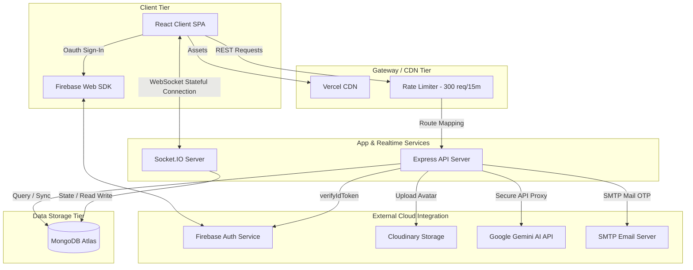
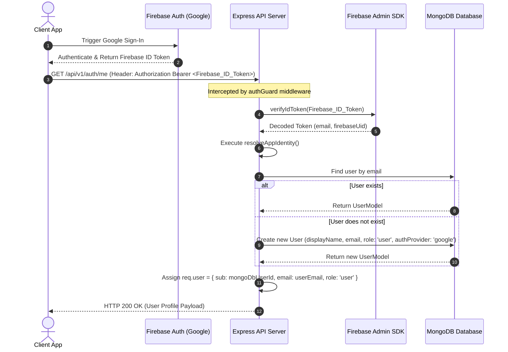
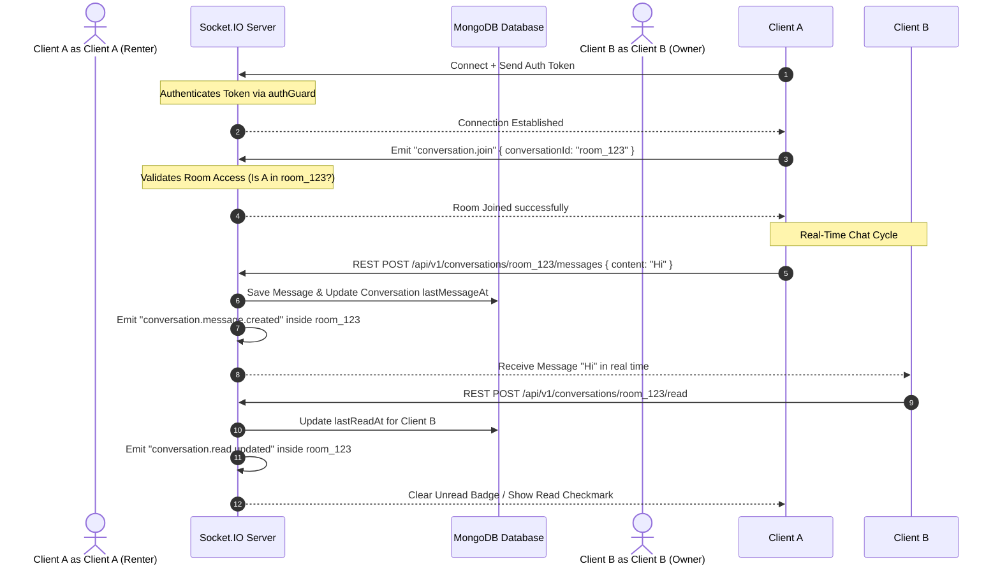

# 🏗 System Architecture & System Design

This document details the system design, network flows, components, and security architectures that power the **URent** ecosystem.

---

## 1. High-Level System Architecture

URent is built upon a modern, distributed architecture combining a React single-page application (SPA), an Express API gateway, a real-time WebSocket server, a managed document database, and specialized cloud services.



---

## 2. Dual-Authentication Architecture (Dual-Auth)

To offer optimal onboarding flexibility, URent supports a dual-authentication mechanism:
1. **Local Authentication**: Classic email-and-password sign-up with dynamic multi-phase email OTP validation.
2. **Google Authentication**: Seamless third-party authentication verified through the Google Firebase Client SDK, secure backend ID Token verification, and dynamic identity synchronization in MongoDB.

### Google Firebase Authentication Flow
The backend accepts Firebase ID tokens directly in the HTTP `Authorization: Bearer <Token>` header. A specialized `authGuard` middleware validates the token, maps it to a MongoDB account, and maps the execution user identity.



### Local Email/Password + OTP Verification Flow
1. **Registration**: `POST /api/auth/register` $\rightarrow$ Validates credentials $\rightarrow$ Generates an 6-digit numeric OTP code $\rightarrow$ Sends it to the email via Nodemailer SMTP.
2. **Validation**: `POST /api/auth/register/verify-otp` $\rightarrow$ Compares input OTP with database record $\rightarrow$ If valid, registers the account as verified and generates a custom, secure JWT token.
3. **Subsequent Calls**: Client caches the JWT token in local storage and includes it as `Authorization: Bearer <Local_JWT>` in the HTTP headers. The `authGuard` verifies this using `JWT_SECRET`.

---

## 3. Real-Time WebSocket Architecture

Real-time interactions (chats, message read badges, and order updates) are handled by a standard **Socket.IO** server.

### WebSocket Gateway Details
- **Unified Authentication**: The WebSocket connection handshake uses the exact same `authGuard` logic, extracting the token from `auth.token` or the standard `Authorization` headers. Invalid tokens result in an immediate `UNAUTHORIZED` connection error.
- **Room Separation**: Client sockets join specialized rooms separated by `conversationId`. This prevents message leakage and restricts communication to authorized chat participants only.
- **Client-to-Server Requests**:
  - `conversation.join` (payload: `{ conversationId }`): Validates participant access, joins the room, and registers the active listener.
  - `conversation.leave` (payload: `{ conversationId }`): Safely unsubscribes from the room updates.
- **Server-to-Client Broadcasts**:
  - `conversation.message.created`: Sent when a member sends a new text, location, or product message.
  - `conversation.read.updated`: Sent when a user marks the chat history as read, updating `unreadCount` badges in real time.



---

## 4. AI Pricing & Valuation Engine (Gemini Proxy)

URent integrates a modern **Google Gemini 2.5 Flash** artificial intelligence model to help users automatically price their rental listings based on images.

### Pipeline Architecture

```text
  [Image File / URL]
          │
          ▼
   [React Canvas API] ──► Resizes to max 768px, converts to JPEG base64 (removes CORS & reduces payload)
          │
          ▼
  [Client App Service] ──► Fetch POST /api/urent-ai/analyze (includes base64 payload & auth token)
          │
          ▼
   [Express Server] ──► Intercepts, runs authGuard, hides GEMINI_API_KEY, forwards request to Gemini
          │
          ▼
  [Google Gemini API] ──► Vision models analyze image against strict JSON Schema (Structured Outputs)
          │
          ▼
   [Express Server] ──► Receives valid JSON Schema response, sends back standard 200 payload
          │
          ▼
  [Client App Service] ──► Validates structure, normalizes values, updates session cache, populates listing form
```

### Vision Prompts & Structured Outputs
To guarantee 100% structural reliability, URent utilizes Gemini **Structured Outputs**. The client service configures `responseMimeType: "application/json"` and submits a highly rigid `responseSchema` detailing the expected attributes.

#### Value Constraints & Mathematical Valuation:
1. **Base Valuation**: The model estimates the item's original/current market value ($V_{\text{market}}$) based on brand, model, and physical appearance.
2. **Suggested Daily Rental Rate**:
   - *Electronics/High-Tech*: $0.5\% - 1.5\%$ of $V_{\text{market}}$ per day.
   - *Fashion/Events/Camping*: $2\% - 5\%$ of $V_{\text{market}}$ per day.
3. **Recommended Security Deposit**: Calculated between $70\% - 100\%$ of $V_{\text{market}}$ to protect listing owners.
4. **Fuzzy Normalization**: Client services parse raw AI responses to map categories directly to URent’s core taxonomy ("Điện tử & Công nghệ", "Du lịch & Dã ngoại", "Đồ dùng học tập", "Thời trang & Đời sống").
5. **Session Caching**: Dynamic responses are hashed based on image names, sizes, or URLs and saved in `sessionStorage` to eliminate redundant, expensive API calls during form edits.
