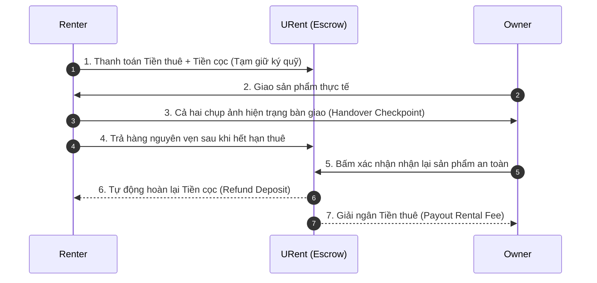

# 📊 Đề xuất Nội dung Slide 2: Phân Tích & Thiết Kế Hệ Thống (URent Ecosystem)

Tài liệu này tổng hợp nội dung chi tiết đã được nâng cấp, tối ưu hóa từ kiến trúc hệ thống của URent để bạn dễ dàng đưa vào slide PowerPoint / Canva / Marp của mình.

---

## 💻 Slide 4: 2. PHÂN TÍCH & THIẾT KẾ HỆ THỐNG (Notable Features)
*Ý tưởng thiết kế:* Thay vì chỉ liệt kê các đầu mục text đơn điệu, hãy chia slide thành **6 thẻ Grid (3x2)** với các từ khóa đắt giá (Notable Highlights) dưới đây:

```text
┌───────────────────────────────────────┬───────────────────────────────────────┐
│ 🔑 2.1 Authentication (Bảo mật)       │ 📦 2.2 Products (Quản lý & Định giá) │
│ - Dual-Auth: Google OAuth & Local OTP │ - Quản lý lịch bận thông minh         │
│ - [NEW] Xác thực danh tính eKYC       │ - [AI Notable] Gemini Pricing Engine  │
├───────────────────────────────────────┼───────────────────────────────────────┤
│ 💬 2.3 Message (Thời gian thực)       │ 🔔 2.4 Notification (Thông báo)       │
│ - Chat Socket.IO mã hóa phòng chat    │ - Real-time In-app Alerts             │
│ - [NEW] Quy trình ảnh chụp Handover   │ - [NEW] FCM Push Notification         │
├───────────────────────────────────────┼───────────────────────────────────────┤
│ ⚙️ 2.5 Settings (Cấu hình nâng cao)   │ 🛡️ 2.6 Admin (Quản trị toàn diện)    │
│ - Quản lý tài khoản & địa chỉ         │ - Giám sát giao dịch và dòng tiền     │
│ - [NEW] Dynamic TrustScore tự động    │ - [NEW] Mediator Dispute Room         │
└───────────────────────────────────────┴───────────────────────────────────────┘
```

### Chi tiết các thẻ thông tin (Copy-paste trực tiếp vào Slide):

*   **2.1 Authentication (Xác thực & Định danh)**
    *   *Core:* Đăng nhập kép linh hoạt (Firebase Google OAuth + Local SMTP OTP 6 chữ số).
    *   *Notable:* **Bảo mật eKYC** - Yêu cầu xác thực giấy tờ (CCCD/Passport) trước khi thuê các sản phẩm giá trị cao nhằm bảo vệ tài sản của Owner.
*   **2.2 Products (Quản lý & Định giá bằng AI)**
    *   *Core:* Thuật toán tìm kiếm không gian (MongoDB `2dsphere` Geospatial Index) giúp quét vị trí sản phẩm xung quanh người dùng chính xác.
    *   *Notable:* **AI Pricing Vision (Gemini 2.5 Flash)** - Phân tích ảnh chụp sản phẩm để gợi ý giá thuê và tiền đặt cọc tự động theo thời gian thực.
*   **2.3 Message (Trò chuyện & Bàn giao)**
    *   *Core:* Chat Socket.IO thời gian thực, tự động cập nhật trạng thái đã xem (Unread Badges) và chia sẻ vị trí/sản phẩm trực tiếp trong khung chat.
    *   *Notable:* **Handover Checkpoint** - Quy trình chụp ảnh hiện trạng thiết bị khi nhận/trả đồ làm bằng chứng pháp lý giải quyết tranh chấp hư hại tài sản.
*   **2.4 Notification (Hệ thống Thông báo)**
    *   *Core:* Thông báo đẩy thời gian thực trong ứng dụng (In-app Alerts) về cập nhật đơn hàng, tin nhắn mới.
    *   *Notable:* **Firebase Cloud Messaging (FCM)** - Đồng bộ thông báo đẩy đa thiết bị (Mobile/Desktop) kể cả khi người dùng không mở trình duyệt.
*   **2.5 Settings (Tối ưu hóa Trải nghiệm)**
    *   *Core:* Quản lý thông tin cá nhân, lịch sử giao dịch và tích hợp ví điện tử.
    *   *Notable:* **Dynamic TrustScore** - Điểm uy tín người dùng tự động cập nhật dựa trên lịch sử hoàn thành đơn, đúng hạn và đánh giá cộng đồng.
*   **2.6 Admin Dashboard (Quản trị & Hòa giải)**
    *   *Core:* Quản lý người dùng, duyệt danh mục sản phẩm, thống kê doanh thu hệ thống.
    *   *Notable:* **Dispute Center (Hòa giải tranh chấp)** - Bảng điều khiển quản trị đối soát ảnh chụp Handover và lịch sử trò chuyện để giải quyết khiếu nại giữa hai bên.

---

## 🎨 Slide 4.1 (Bổ sung): ĐỘT PHÁ CÔNG NGHỆ VỚI TRÍ TUỆ NHÂN TẠO (AI Gemini Engine)
*Mục tiêu:* Chứng minh với hội đồng phản biện dự án có chiều sâu công nghệ vượt trội.

*   **Pipeline hoạt động Định giá tự động:**
    1.  *Client:* Chụp ảnh sản phẩm $\rightarrow$ Resize & nén trực tiếp qua HTML5 Canvas $\rightarrow$ Gửi chuỗi base64 tối ưu lên Backend.
    2.  *Backend API Proxy:* Tiếp nhận yêu cầu, bảo mật `GEMINI_API_KEY`, chuyển tiếp đến mô hình Gemini 2.5 Flash.
    3.  *AI Engine (Gemini 2.5 Flash):* Đọc ảnh sản phẩm dưới định dạng JSON cấu trúc chuẩn định sẵn (Structured Outputs).
    4.  *Kết quả tự động gợi ý:*
        *   **Ước lượng giá trị tài sản:** Đánh giá độ mới (New, 99%, 95%, Used) để ước lượng giá trị thực tế ($V_{market}$).
        *   **Đề xuất giá thuê:** $0.5\% - 1.5\%$ giá trị đối với Đồ công nghệ, $2\% - 5\%$ đối với Đồ dã ngoại/Thời trang.
        *   **Tiền đặt cọc đề xuất:** Đảm bảo an toàn ở mức $70\% - 100\%$ giá trị sản phẩm.

---

## 🛡️ Slide 4.2 (Bổ sung): QUY TRÌNH KÝ QUỸ & BÀN GIAO AN TOÀN (Secure Escrow Flow)
*Mục tiêu:* Thuyết phục nhà đầu tư về tính thực tiễn và mô hình vận hành không rủi ro tài chính của URent.



*   **Lợi ích cốt lõi:**
    *   **Không lo lừa đảo:** Tiền cọc nằm ở bên trung gian uy tín, tránh việc Owner giữ cọc bùng tiền hoặc Renter phá đồ trốn cọc.
    *   **Bằng chứng không thể chối cãi:** Ảnh chụp Handover được lưu trữ bất biến trên Cloudinary kèm mã đơn hàng.
