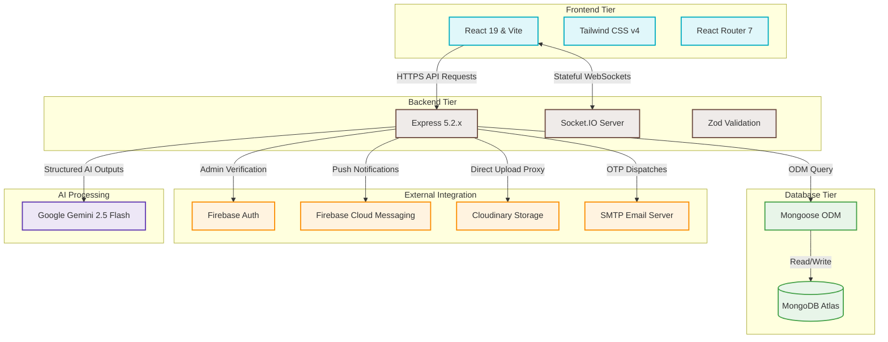

# 🛠️ URent Technology Stack & Infrastructure

This document provides a comprehensive and detailed catalog of the technologies, libraries, services, and structural architectures utilized across the **URent** ecosystem.

---

## 1. High-Level Technology Blueprint

URent leverages a modern, decoupled architecture designed for high availability, real-time interactivity, and intelligent automation. The system is managed as a **Monorepo** using npm workspaces.



---

## 2. Core Workspace Orchestration

The project operates as an npm workspaces monorepo, enabling atomic package management and unified execution routines.

* **npm Workspaces**: Orchestrates `urent-client` and `urent-server` as isolated modules under a single repository root.
* **Concurrently (v9.2)**: Enables the root workspace to run multiple child server processes in parallel.
  - Command: `npm run dev` spawns both the client developer server and the backend API server with colored logs.

---

## 3. Frontend Client Stack (`urent-client`)

The user interface is built as a highly responsive React Single-Page Application (SPA) powered by Vite.

### 3.1 Core Frameworks & Tooling
* **React (v19.2)**: The rendering engine for building UI components. Leveraging React 19's optimized rendering pipelines and concurrent feature support.
* **Vite (v6.4)**: The build tool and development server. Delivers near-instant Hot Module Replacement (HMR) and optimized rollup production bundles.
* **TypeScript (v5.9)**: Imposes static typing, structural integrity, and compiler-level safeguards across the client application.

### 3.2 Styling & Presentation
* **Tailwind CSS v4 (v4.2)**: Employs a utility-first styling system integrated via the `@tailwindcss/vite` compiler. Delivers zero-runtime overhead styles, complete design token customization, fluid responsive interfaces, and dark-mode adaptations.
* **Lucide React (v1.7)**: Provides a premium, lightweight, vector-based icon set packed as direct React components.
* **tailwind-merge & clsx**: Handles safe, programmatic merging of conflicting Tailwind CSS utility classes on dynamic UI components.

### 3.3 State, Routing & Real-Time Communication
* **React Router Dom (v7.14)**: Powers client-side routing, nested layouts, and secure navigation guards.
* **Socket.io-client (v4.8)**: Sustains persistent duplex WebSocket pipelines with the backend for real-time messaging, activity notifications, and system alerts.
* **Axios (v1.15)**: Handles RESTful communication with backend services, featuring centralized interceptors for dynamic JWT authorization mapping.

### 3.4 Third-Party Integrations
* **@react-google-maps/api**: Embeds interactive Google Maps, enabling geocoded product searches, pins, and spatial listings navigation.
* **Firebase Web SDK (v12.12)**: Handles OAuth 2.0 handshake interactions for Google Sign-In protocols on the client browser.
* **Lodash (v4.18)**: Utility toolbelt for secure and highly optimized object clones, array mapping, and debouncing routines.

---

## 4. Backend Service Stack (`urent-server`)

The server-side operates as an Express API gateway, delivering secure routes, token validation, real-time message rooms, and cloud service proxies.

### 4.1 Server Framework & Runtime
* **Node.js (>=20.x)**: High-performance, event-driven JavaScript runtime engine.
* **Express (v5.2)**: The web server framework. Express 5 provides asynchronous routing, clean controller models, and a highly customizable middleware pipeline.
* **TSX (v4.21)**: TypeScript Execute. Powers high-speed execution of backend `.ts` files directly in development using internal esbuild routines, avoiding slow manual TSC compiles.

### 4.2 Database & Object Mapping
* **Mongoose (v8.18)**: MongoDB Object Data Modeling (ODM) framework. Enforces structural schema validation, handles model relations, and abstracts complex database aggregations.

### 4.3 Validation & Utility Libraries
* **Zod (v4.3)**: A TypeScript-first schema declaration and runtime validation library. Sanitizes and validates client payloads before controller routing, guaranteeing clean runtime data.
* **BcryptJS (v3.0)**: Hashes and salts passwords using slow hashing cryptography for local database credential storage.
* **Cookie-parser (v1.4)**: Parses incoming request cookie headers, storing credentials in browser cookies.
* **Cors (v2.8)**: Imposes Cross-Origin Resource Sharing restrictions, securing backend endpoints against unauthorized cross-site requests.
* **Dotenv (v17.4)**: Loads environment configurations from secure `.env` files.

---

## 5. Data Tier & Storage Strategy

URent uses **MongoDB** as its primary document store, combined with advanced indexing structures to ensure high performance at scale.

### 5.1 Geospatial Indexing (`2dsphere`)
The `Product` collection employs a `2dsphere` geospatial index on the coordinates array field:
```typescript
location: {
  type: { type: String, enum: ['Point'], default: 'Point' },
  coordinates: { type: [Number], index: '2dsphere' } // [lng, lat]
}
```
This enables extremely fast geospatial searches such as `$nearSphere` or `$geoWithin` to find rental items in the user's immediate vicinity.

### 5.2 Indexing Safeguards
* **Sparse Indexes**: Set to `sparse: true, unique: true` on fields like `phone` and `username` to permit null values for Google OAuth users without causing uniqueness collisions.
* **Sorted Indexes**: Timestamps (e.g., `{ lastMessageAt: -1 }`, `{ createdAt: -1 }`) are pre-sorted in the database to optimize pagination and avoid heavy in-memory sorting.
* **Compound Indexes**: Unique compound keys like `{ conversationId: 1, userId: 1 }` on `ConversationParticipant` to prevent duplicate membership registers.

---

## 6. Integrations & Cloud Infrastructure

### 6.1 Authentication Hub (Dual-Auth)
URent integrates two authentication vectors inside a unified backend `authGuard` middleware:
1. **Local Authentication**: Uses custom JWT tokens generated on successful register/login.
2. **Google OAuth via Firebase Admin SDK**: Validates client-side Google OAuth tokens directly on the server utilizing `verifyIdToken()`, mapping users to specialized Mongo documents.

### 6.2 Real-Time Communication Hub
* **Socket.IO (kết hợp `ws` v8.19)**: Orchestrates persistent TCP channels.
  - **Conversations Rooms**: Clients join specific `conversationId` rooms, isolating chats and avoiding leaks.
  - **Synchronized Badges**: Real-time read-receipt emissions (`conversation.read.updated`) clear unread counts on-the-fly.

### 6.3 AI Valuation Engine (Gemini 2.5 Flash Proxy)
URent leverages **Google Gemini 2.5 Flash** to provide instant rental pricing suggestions based on upload images:
* **Payload Compression**: Client uses React Canvas to scale down images to a maximum of 768px (JPEG format) to minimize payloads and avoid CORS constraints.
* **Structured JSON Outputs**: Configures `responseMimeType: "application/json"` using a strict JSON schema to enforce standard outputs containing original valuation, recommended daily rental rate ($0.5\% - 1.5\%$ for electronics; $2\% - 5\%$ for gear), and safety deposits.
* **Client Caching**: Hashed file payloads are cached in `sessionStorage` to avoid redundant, costly AI requests.

### 6.4 Storage CDN & Operations
* **Cloudinary**: Acts as the primary CDN storage for listing images and user avatars, optimizing and serving media assets dynamically.
* **Firebase Cloud Messaging (FCM)**: Registers browser device tokens (`fcmtokens`) and dispatches cross-platform push notifications for incoming messages and order updates.
* **Nodemailer SMTP**: Links to external mail relays (Gmail SMTP) to dispatch registration OTP codes and password reset alerts.

---

## 7. Deployment & Operations (DevOps)

### 7.1 Serverless Web Hosting (Vercel)
* **Client Deployment**: React SPA compiles static bundles directly to Vercel's Edge Network, utilizing a fallback rule (`vercel.json`) to redirect traffic to `index.html` for client-side routing.
* **Backend Serverless Functions**: The Express API compiles to serverless instances.
  - **Lazy Database Connector**: Implements dynamic Mongoose connection middleware to connect to MongoDB Atlas on-demand, caching connection pools to negate severe serverless cold start delays.

### 7.2 Stateful VM / VPS (Stateful Target - Recommended)
Since stateful WebSockets (Socket.IO) are incompatible with stateless, short-lived Serverless Functions, URent is dockerized to deploy to VPS providers (AWS EC2, DigitalOcean, Fly.io):
* **Docker Containerization**: Packages the Node.js 20 environment securely.
* **Nginx Reverse Proxy**: Upgrades HTTP connections to support stateful WebSocket protocols:
  ```nginx
  proxy_set_header Upgrade $http_upgrade;
  proxy_set_header Connection "upgrade";
  ```

---

## 8. Quality Assurance & API Documentation

* **Vitest (v4.1)**: Extends fast, watch-mode Unit testing on client components.
* **Swagger (swagger-jsdoc & swagger-ui-express)**: Generates automated, interactive API documentation exposed at `/api-docs` to facilitate seamless frontend/backend integration.
