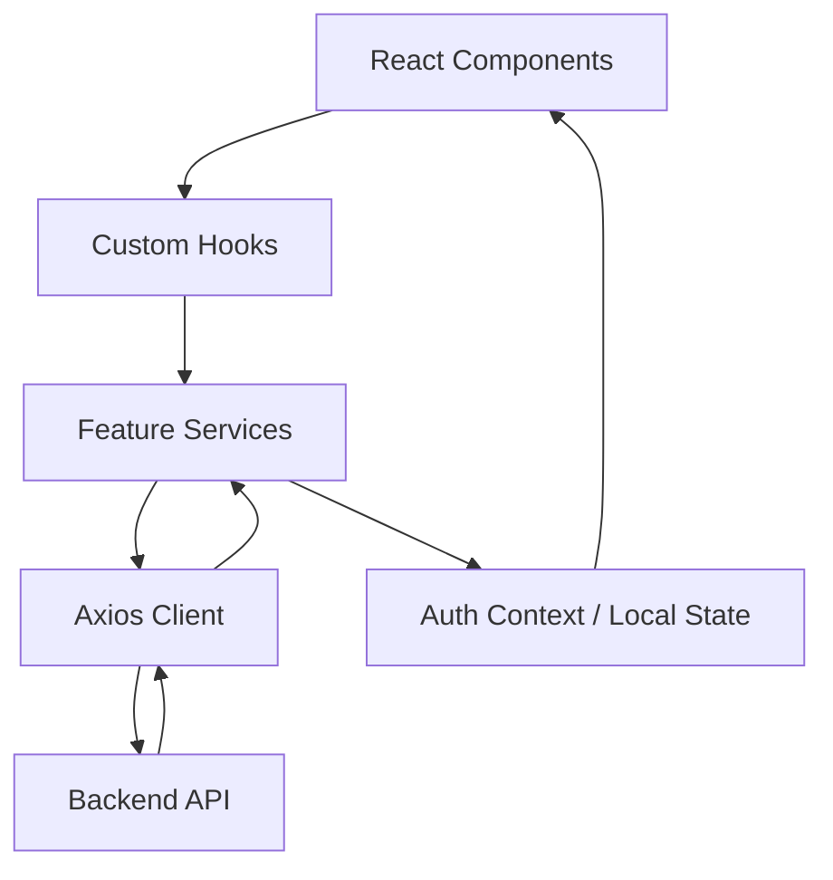

# 🏗 Kiến trúc Hệ thống URent Client

Tài liệu này mô tả chi tiết về cấu trúc kỹ thuật, luồng dữ liệu và các quyết định thiết kế trong dự án URent Client.

## 1. Nguyên tắc thiết kế (Design Principles)

Dự án tuân thủ các nguyên tắc sau:

- **Separation of Concerns (SoC)**: Tách biệt logic nghiệp vụ, giao diện và xử lý dữ liệu.
- **Single Source of Truth**: Sử dụng Context API hoặc Global State để quản lý dữ liệu quan trọng như Authentication.
- **Component-Driven Development**: Xây dựng ứng dụng từ những component nhỏ, tái sử dụng được.

## 2. Cấu trúc Feature-based

Mỗi thư mục trong `src/features` là một module độc lập bao gồm:

- `components/`: Các UI component chỉ dùng cho tính năng này.
- `pages/`: Các trang hoàn chỉnh (routables).
- `hooks/`: Custom hooks xử lý logic riêng cho feature.
- `services/`: Các hàm gọi API (thường dùng Axios).
- `types.ts`: Định nghĩa kiểu dữ liệu TypeScript cho module.
- `constants.ts`: Các hằng số, config riêng.

## 3. Hệ thống xác thực (Authentication Flow)

Dự án hỗ trợ hai phương thức xác thực song song:

### 3a. JWT (Email / Password)

- **Token Storage**: Access token được lưu trong `localStorage` qua `tokenStorage.ts`.
- **Auth Interceptor**: `apiClient.ts` tự động đính kèm `Authorization: Bearer <token>` vào mọi request.
- **Session Bootstrap**: Khi ứng dụng khởi chạy, `AuthContext` gọi `GET /api/auth/me` để khôi phục session từ token đã lưu.
- **Automatic Logout**: Nếu nhận `401 Unauthorized`, hệ thống dispatch sự kiện `auth:session-expired`, `AuthContext` lắng nghe và tự động đăng xuất.

### 3b. Firebase (Google Sign-In / Phone OTP)

- **Google Sign-In**: Dùng `signInWithPopup(GoogleAuthProvider)` để lấy Firebase ID token, sau đó gửi `POST /api/auth/google` để backend xác thực và cấp JWT của ứng dụng.
- **Phone OTP (Settings)**: JWT users cần Firebase session để xác minh số điện thoại. `PhoneVerificationModal` gọi `GET /api/auth/firebase/custom-token` → `signInWithCustomToken()` → bắt đầu luồng OTP qua Firebase SMS (`RecaptchaVerifier` + `signInWithPhoneNumber`).

## 4. Xử lý API & Dữ liệu

Dự án sử dụng **Axios** được cấu hình tại `src/lib/api/apiClient.ts`:

- **Timeout**: Mặc định 10 giây để đảm bảo trải nghiệm người dùng.
- **Error Handling**: Một lớp xử lý lỗi tập trung giúp chuẩn hóa thông báo lỗi từ Server thành các định dạng thân thiện với người dùng.

## 5. Styling & Giao diện

- **TailwindCSS 4**: Sử dụng các tính năng mới nhất của Tailwind 4 như CSS-first configuration.
- **Design System**: Các thành phần UI cơ bản (Button, Input, Modal...) được tập trung tại `src/shared/components` để đảm bảo tính nhất quán (Consistency).
- **Responsive**: Ưu tiên thiết kế Mobile-first.

## 6. Real-time Communication

Sử dụng **Socket.io-client** để xử lý:

- Nhắn tin trực tiếp giữa người dùng.
- Thông báo trạng thái đơn hàng ngay lập tức.
- Cập nhật số lượng sản phẩm trong kho theo thời gian thực.

## 7. Sơ đồ luồng dữ liệu (Data Flow)

---

_Tài liệu này giúp lập trình viên mới dễ dàng nắm bắt được luồng hoạt động chính của dự án._
